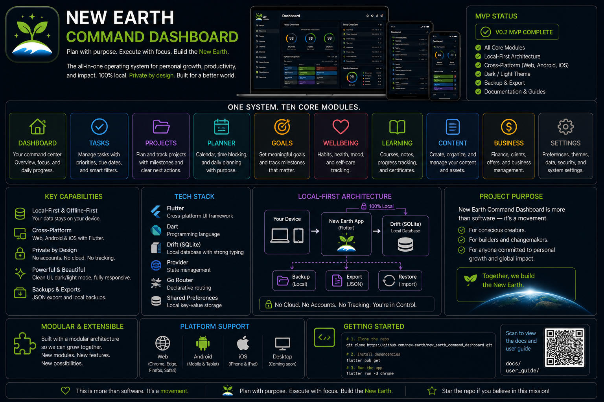
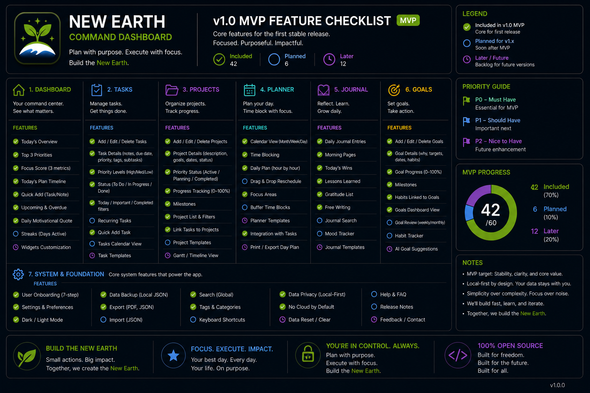

# Gaia

Local-first Flutter app for managing New Earth projects, tasks, daily focus, learning, content, business, wellbeing and build progress.

## Current Status

V0.1 foundation is live:

- Dashboard-first launch
- Material 3 New Earth theme
- Bottom navigation
- More screen links
- Drift/SQLite database foundation
- MVP database tables
- Default seed data and app settings
- Startup DailyPlan creation
- Dashboard reads local startup data
- Projects screen reads seeded projects
- Project detail and add/edit flows are live
- Project archive from Project Detail is live
- Project detail now surfaces linked journal history
- Tasks screen reads local tasks
- Task create/edit flows are live
- Task status actions, filters, and archive foundation are live
- Task search by title and notes is live
- Journal list, create-entry, and edit-entry foundation are live
- Learning list, add-topic, and edit-topic foundation are live
- Content list, add-idea, and edit-idea foundation are live
- Business list and add-opportunity foundation are live
- Wellbeing list and check-in foundation are live
- Inbox list and add-item foundation are live
- Dashboard Quick Capture saves directly into Inbox
- Settings screen now loads local app settings, shows the Top 3 rule, shows app version, and controls dashboard support-card visibility
- Voice Assistant v0.1 scaffold is present and intentionally parked for later expansion
- On Windows, Gaia now waits for a connected headset or headset microphone before the main dashboard loads
- Meeting System phase 1 is live with dashboard, meeting index, wizard, detail, and trackers
- Launchpad module phase 1 is live with campaign manager, rewards, story builder, readiness tracker, finance modeller, and JSON seed import; phase 2 now adds media, grants, investors, partners, manufacturing, community, timeline, and analytics records; the next polish pass adds launch checklist, backer updates, fulfilment, and impact tracking
- If you move the repo to a new folder, clear `build/windows/x64` and `.dart_tool`, then run `flutter clean` and `flutter pub get` before building Windows again

## Documentation

- [Documentation Home](docs/README.md)
- [Getting Started](docs/user_guide/getting_started.md)
- [App Roadmap](docs/roadmap/app_roadmap.md)
- [Meeting System module](modules/meeting_system/README.md)
- [Launchpad module](modules/new_earth_launchpad_module/README.md)
- [MVP Roadmap](docs/roadmap/mvp_roadmap.md)
- [Architecture Decisions](docs/architecture/architecture_decisions.md)
- [Visual Direction](docs/design/visual_direction.md)
- [Asset Index](docs/assets/asset_index.md)
- [Local Build Guide](docs/developer_guide/local_build.md)

## How To Use The App

This app is now far enough along to support a real daily workflow.

Best simple rhythm:

1. Open `Dashboard`
2. Set `Main Focus`, `Why It Matters`, and `Morning Intention`
3. Choose your `Top 3`
4. Work from `Projects` and `Tasks`
5. Use `Quick Capture` for loose thoughts
6. Close the day with `Start Evening Review`

If you want the full operating guide, use:

- [Detailed User Guide](docs/user_guide/getting_started.md)

## Best Visual Assets

These are the most useful documentation visuals right now:

- README banner: `assets/repo/01_repo_banner_new_earth_command_dashboard.png`
- GitHub overview: `assets/repo/33_github_readme_visual_overview.png`
- MVP checklist: `assets/repo/42_v01_mvp_feature_checklist.png`
- Dashboard user manual: `assets/user_guide/36_dashboard_user_manual_page.png`
- Projects and Tasks manual: `assets/user_guide/37_projects_tasks_user_manual_page.png`
- Journal and Planner manual: `assets/user_guide/38_journal_planner_user_manual_page.png`
- Quick start guide: `assets/user_guide/35_getting_started_quick_start.png`
- Mobile overview: `assets/screenshots/27_mobile_app_screens_overview.png`
- Daily planning flow: `assets/screenshots/28_daily_planning_flow.png`
- Project detail explainer: `assets/screenshots/29_project_detail_screen_explained.png`

## Visual References

## Visual System

The repo includes a strong PNG asset library for brand, layouts, diagrams, screenshots, user guide pages, and GitHub documentation.

Use the dark neon New Earth style for documentation and repo visuals. Use the calmer light Material 3 theme for the working app UI so the dashboard stays clear and low-overwhelm.
