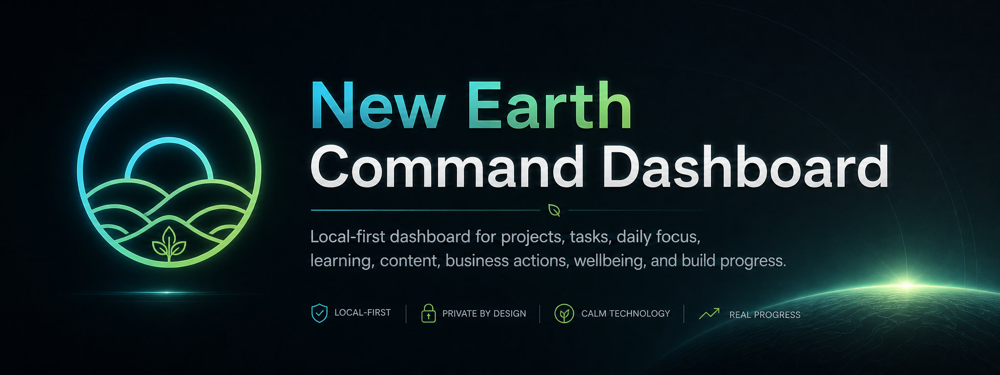

# New Earth Command Dashboard

Local-first Flutter app for managing New Earth projects, tasks, daily focus, learning, content, business, wellbeing and build progress.

## Current Status

V0.1 foundation is live:

- Dashboard-first launch
- Material 3 New Earth theme
- Bottom navigation
- More screen links
- Drift/SQLite database foundation
- MVP database tables
- Default seed data and app settings
- Startup DailyPlan creation
- Dashboard reads local startup data
- Projects screen reads seeded projects
- Project detail and add/edit flows are live
- Project archive from Project Detail is live
- Tasks screen reads local tasks
- Task create/edit flows are live
- Task status actions, filters, and archive foundation are live
- Task search by title and notes is live
- Journal list, create-entry, and edit-entry foundation are live
- Voice Assistant v0.1 scaffold is present and intentionally parked for later expansion

## Documentation

- [Documentation Home](docs/README.md)
- [Getting Started](docs/user_guide/getting_started.md)
- [MVP Roadmap](docs/roadmap/mvp_roadmap.md)
- [Architecture Decisions](docs/architecture/architecture_decisions.md)
- [Visual Direction](docs/design/visual_direction.md)
- [Asset Index](docs/assets/asset_index.md)
- [Local Build Guide](docs/developer_guide/local_build.md)

## Visual System

The repo includes a strong PNG asset library for brand, layouts, diagrams, screenshots, user guide pages, and GitHub documentation.

Use the dark neon New Earth style for documentation and repo visuals. Use the calmer light Material 3 theme for the working app UI so the dashboard stays clear and low-overwhelm.
