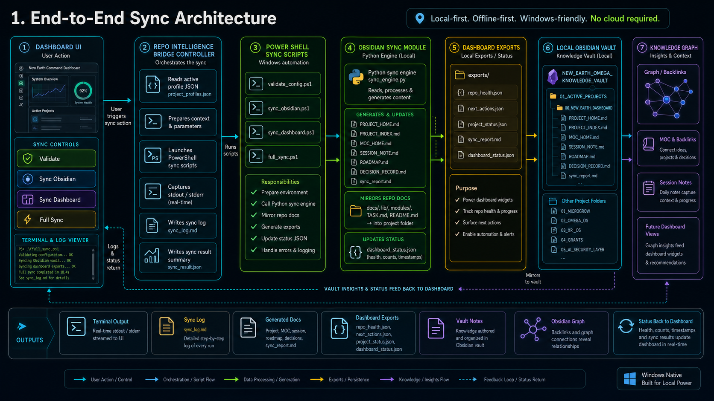
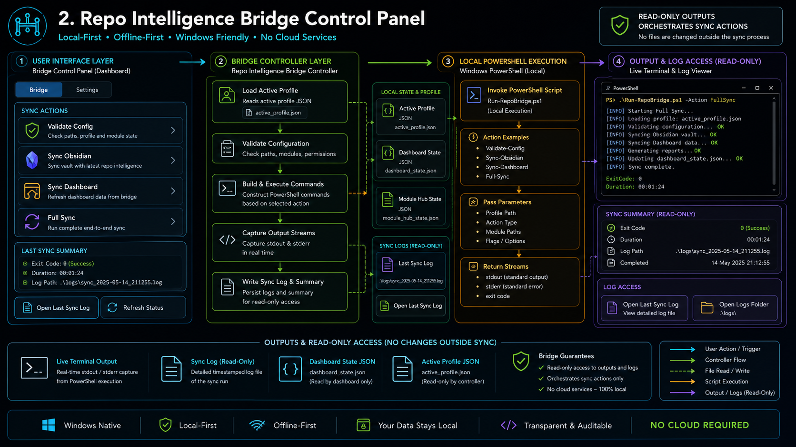
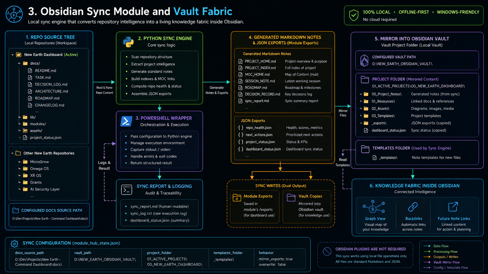
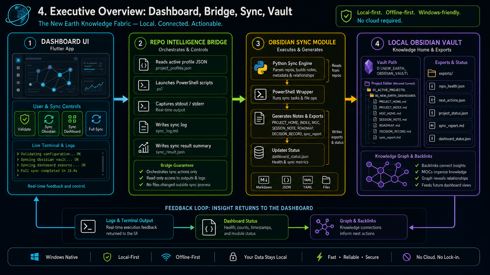

# New Earth Knowledge Fabric Sync Architecture

This page groups the three companion diagrams that explain the full local-first documentation and sync flow.

## 1. End-to-End Sync Architecture

Shows the full path from dashboard action to bridge orchestration, Obsidian sync, vault mirroring, exports, and the feedback loop back into the dashboard.

## 2. Repo Intelligence Bridge Control Panel

Shows how the dashboard UI triggers the bridge controller, runs PowerShell sync commands, captures live output, and exposes the last sync log.

## 3. Obsidian Sync Module and Vault Fabric

Shows how the local repo tree becomes generated markdown, JSON exports, vault copies, backlinks, session notes, and graph-backed knowledge.

## 4. Executive Overview

Shows the whole flow in one presentation-friendly view for quick recall.

## Why This Set Matters

- It keeps the whole flow local-first.
- It separates the dashboard control layer from the vault-building engine.
- It makes the docs easier to review from top-level flow down to implementation details.
- It gives the repo one indexed place to explain how the system works end to end.
