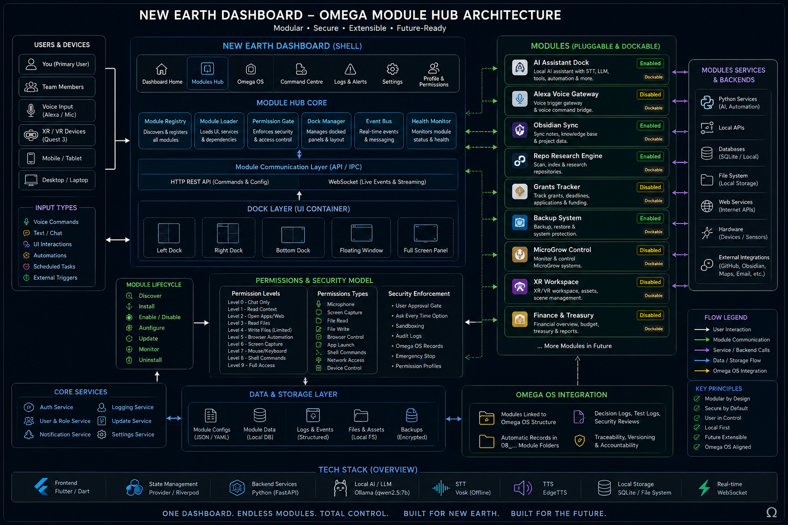

# New Earth Dashboard - Module Hub Architecture

This document defines the visual reference architecture for the New Earth Dashboard Module Hub system.

The Module Hub is designed to allow future dashboard modules to be registered, enabled, disabled, configured, docked, monitored, permission-gated, and connected to local services without hard-coding every feature into the dashboard core.

## Architecture Visual



## Purpose

This visual should be used as the build reference for:

- Module Hub UI
- Module Registry
- Module Loader
- Dock Manager
- Permission Gate
- Health Monitor
- Event Bus
- Local backend bridge
- Omega OS integration
- Future dockable modules

## Key Principle

The dashboard should not become one tangled app.

It should become a modular command centre where every major feature is added as a controlled, permissioned module.

## Build Rules

1. Do not hard-code modules directly into the dashboard shell.
2. Register modules through manifests.
3. Keep the Module Hub core separate from module-specific logic.
4. Use placeholder panels first, then connect real backends one module at a time.
5. Permission-gate powerful actions before enabling them.
6. Keep Omega OS records linked to every module.

## Recommended Repo Location

```text
docs/architecture/module_hub/
├── README.md
├── module_hub_architecture.md
└── visuals/
    └── new_earth_module_hub_architecture.png
```

## Codex Instruction

Use this architecture visual as the reference for building the Module Hub UI, module registry, dock manager, permission system, health monitor, event bus, local backend bridge, Omega OS integration, and future plugin/module shell.

Do not hard-code modules directly into the dashboard. Build the shell so future modules can be registered through manifests and mounted into the UI.

