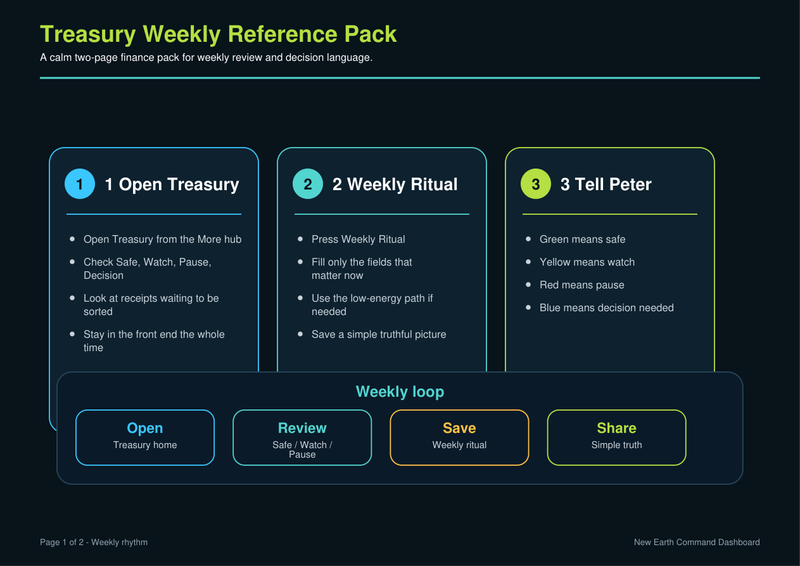
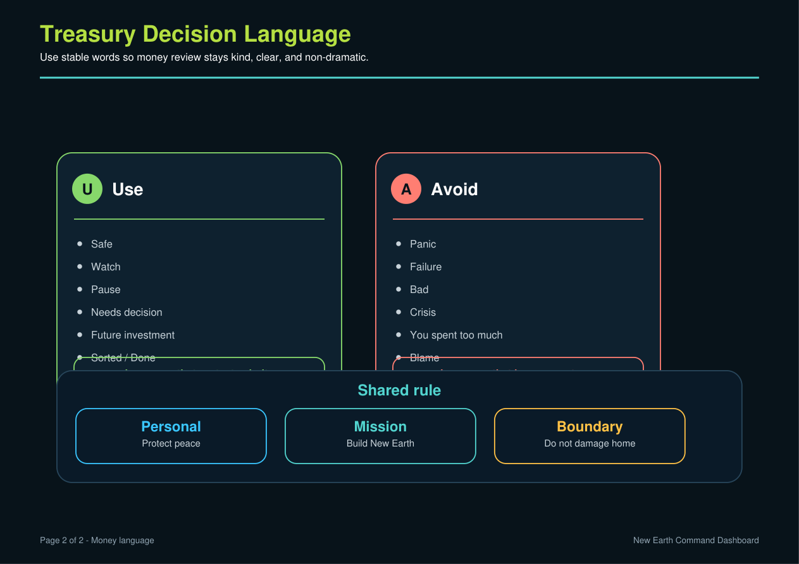

# Hayley — Start Here

This Treasury tab is being built to make finance calmer.

You should be able to open the Dashboard and quickly see:
- What is safe
- What needs watching
- What should pause
- What needs a decision
- What receipts need sorting

## Weekly flow
1. Open Treasury.
2. Press Weekly Ritual.
3. Follow the cards.
4. Save the review.
5. Tell Peter the simple truth.

## Printable pack

Use the printable weekly pack when you want the calm wall version:

- `output/pdf/treasury_weekly_reference_pack.pdf`

Preview pages:





## Simple truth format
```text
Green: safe.
Yellow: watch.
Red: pause.
Blue: decision needed.
```
