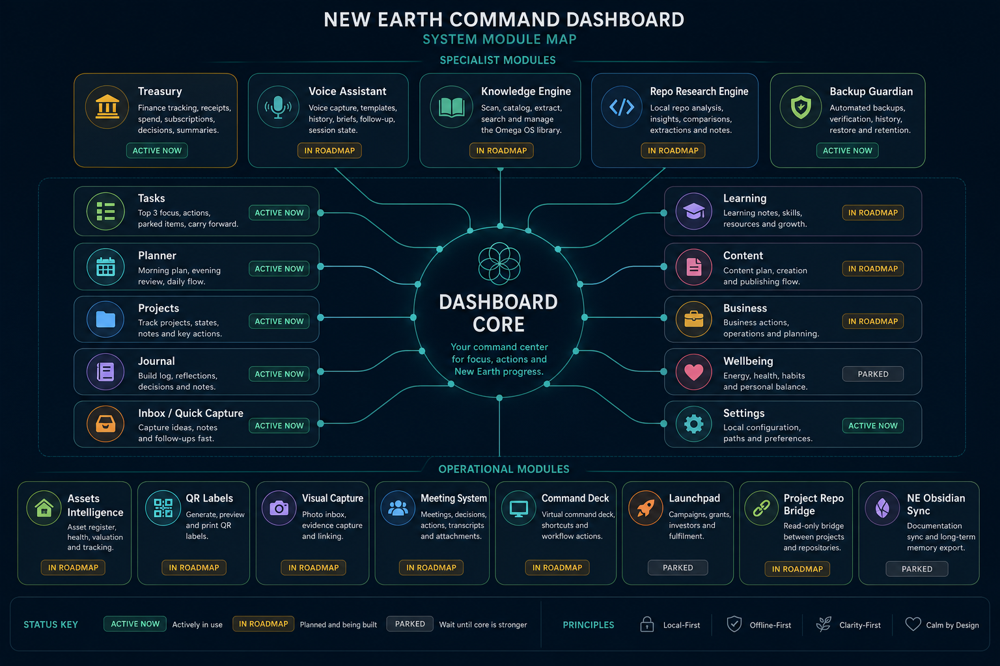

# Dashboard Module Map

This is the visual overview of the New Earth Command Dashboard and its surrounding modules.

## How To Read It

- `Dashboard Core` is the center of the system.
- The core dashboard surfaces are the everyday working lanes.
- The specialist modules extend the core into finance, voice, knowledge, backup, assets, capture, meetings, hardware control, launch, and long-term memory.
- `Active now` means already in use or already implemented in a meaningful way.
- `In roadmap` means the module is planned and should stay in the build queue.
- `Parked` means it should wait until the local-first core is stronger.

## What This Map Is Saying

The Dashboard is already the main control surface.

The safest way forward is to keep the core dashboard stable, finish the tightly coupled operating modules first, and leave broad expansion items parked until the system grows into them.

## Linked Roadmaps

- [Landscape Summary](dashboard_module_landscape.md)
- [Ranked Roadmap](dashboard_ranked_roadmap.md)
- [App Roadmap](app_roadmap.md)

