# Visual Project Map

This page gives a visual-style overview of how the project fits together.

```mermaid
flowchart TB
    A[New Earth Command Dashboard]

    subgraph NOW[Now - Active Core]
        B[Shell / Daily Workflow]
        C[Module Layer]
        D[Voice Layer]
        E[Knowledge Layer]
        F[Operational Layer]
    end

    subgraph NEXT[Next - Hardening]
        G[Release Readiness]
        H[Voice Polish]
        I[QR and Print Hardening]
        J[Template-First Doc Stability]
    end

    subgraph LATER[Later - Parked Future Layers]
        K[AI Layer]
        L[Integration Layer]
        M[Live Dock Host]
    end

    A --> B
    A --> C
    A --> D
    A --> E
    A --> F
    A -.-> G
    A -.-> H
    A -.-> I
    A -.-> J
    A -.-> K
    A -.-> L
    A -.-> M

    B --> B1[Dashboard]
    B --> B2[Tasks]
    B --> B3[Planner]
    B --> B4[Projects]
    B --> B5[Journal / Inbox / Learning / Content / Business / Wellbeing]

    C --> C1[Module Hub Registry]
    C --> C2[Module Details]
    C --> C3[Docking Preview]
    C --> C4[Governance]

    D --> D1[Voice Capture]
    D --> D2[Wizard + Briefing]
    D --> D3[Wake Phrase]
    D --> D4[Shared Session State]

    E --> E1[Knowledge Library]
    E --> E2[Repo Intelligence Bridge]
    E --> E3[Obsidian Sync]
    E --> E4[Dashboard Exports]

    F --> F1[Treasury]
    F --> F2[Assets]
    F --> F3[QR Labels]
    F --> F4[Print Queue]

    G --> G1[V0.1 release readiness]
    G --> G2[Inbox processing]
    G --> G3[Project detail surfacing]

    H --> H1[Remembered thread polish]
    H --> H2[Briefing clarity]
    H --> H3[Follow-up chips]
    H --> H4[Reply tuning]

    I --> I1[Queue reliability]
    I --> I2[Printer presets]
    I --> I3[Label history]

    J --> J1[Docs consistency]
    J --> J2[Template profiles]
    J --> J3[Reusable exports]

    K --> K1[Adapter contract]
    K --> K2[Local stub]
    K --> K3[Opt-in gates]

    L --> L1[Calendar]
    L --> L2[GitHub]
    L --> L3[WordPress]
    L --> L4[MicroGrow]
    L --> L5[Cloud sync]

    M --> M1[First live docked module]
    M --> M2[Persisted dock position]
    M --> M3[Second live docked module]

    classDef active fill:#173B2E,stroke:#4AD18C,color:#E9FFF3,stroke-width:1px;
    classDef next fill:#3A3416,stroke:#F0C94A,color:#FFF8D6,stroke-width:1px;
    classDef later fill:#2F2447,stroke:#B08CFF,color:#F4EEFF,stroke-width:1px;
    classDef anchor fill:#15202B,stroke:#5BC0FF,color:#EAF7FF,stroke-width:1px;

    class A anchor;
    class B,C,D,E,F active;
    class G,H,I,J next;
    class K,L,M later;
```



## Status Legend

```text
Now    = active core
Next   = hardening and release readiness
Later  = intentionally parked future work
```

## Color Key

- Green: current working core
- Amber: next hardening steps
- Purple: later parked layers

## How To Read It

- The **shell** is the daily working surface.
- The **module layer** controls registries, docking, and governance.
- The **voice layer** handles speech capture and conversational flow.
- The **knowledge layer** handles docs, exports, and repo memory.
- The **operational layer** handles Treasury and asset-related work.
- The **AI layer** is intentionally downstream and gated.
- The **integration layer** stays parked until the core is stable.

## Current Focus Markers

- V0.1 release readiness
- voice polish
- QR and print hardening
- template-first documentation consistency

## Visual Intent

This map should help you see the project as a set of layers, not as one giant block of work.
