# Getting Started

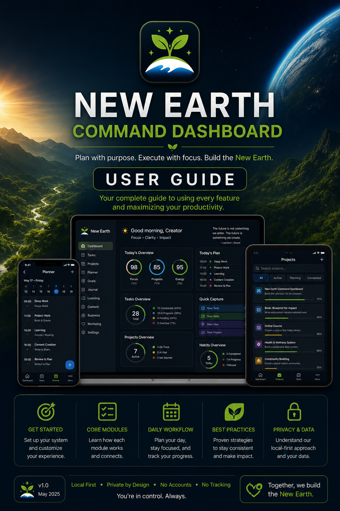

New Earth Command Dashboard is designed to help you run a large mission without losing the thread of what matters today.

This guide is written for real use, not just feature reference. The goal is to help you fold the app into your daily working rhythm.

## Quick Orientation

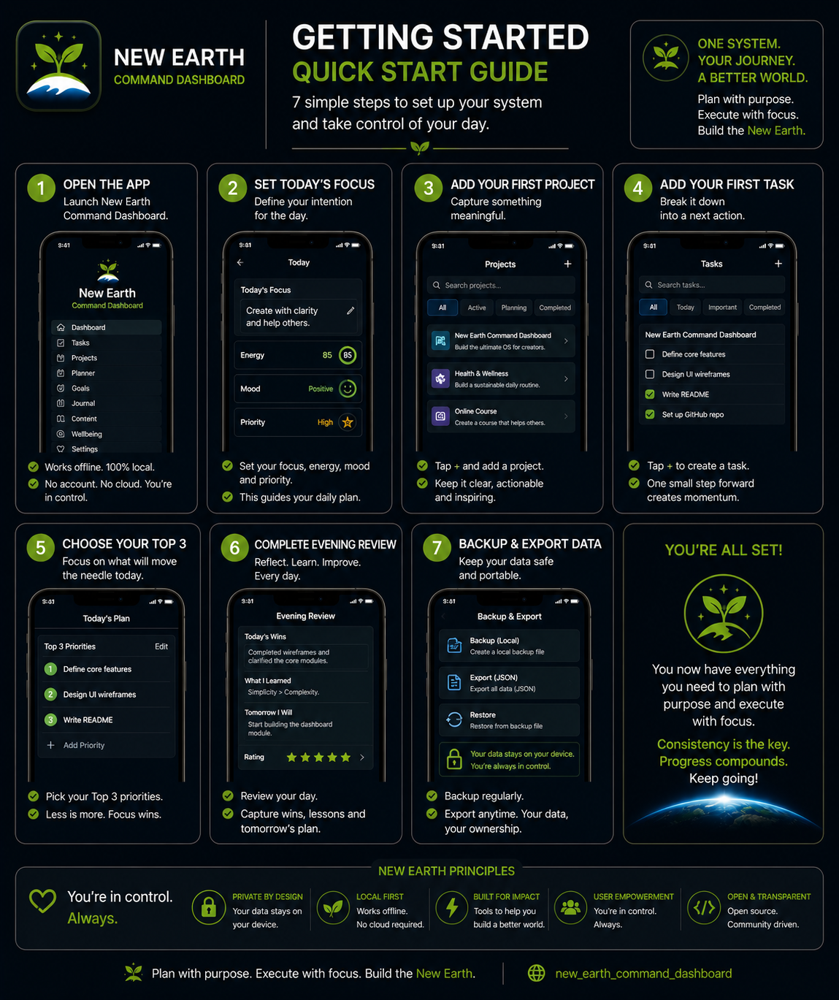

The app has five main navigation areas:

- `Dashboard`: your home screen for today's direction
- `Projects`: the big-picture structure of New Earth
- `Tasks`: the action layer across all projects
- `Planner`: the full daily planning and review space
- `More`: supporting modules like Journal, Learning, Content, Business, Wellbeing, Inbox, and Settings

If you only remember one thing, remember this:

1. Start on `Dashboard`
2. Set today's focus
3. Pick your Top 3
4. Work from `Projects` and `Tasks`
5. Capture loose thoughts in `Inbox`
6. Close the day in `Planner`

## What the App Is Good For Right Now

The current build is already useful for:

- deciding what today is about
- keeping only three priority tasks visible
- tracking project progress without losing the wider map
- capturing progress in Journal
- collecting learning topics, content ideas, business opportunities, wellbeing check-ins, and inbox items
- reviewing the day and carrying forward what still matters

The app is not yet trying to automate your whole life. It is strongest as a calm command center for mission clarity.

## First Launch Expectations

When the app opens:

- the Dashboard is the first screen
- default New Earth projects already exist
- today's blank `DailyPlan` is created automatically
- app settings are seeded automatically

That means you do not need to set up the system from zero before using it.

## Your Recommended Daily Flow

## Morning Setup

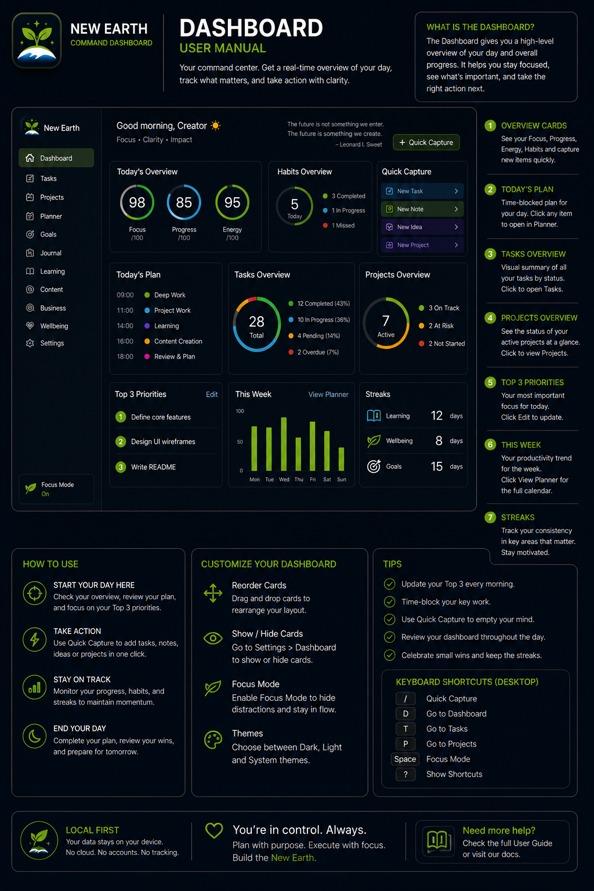

Use this routine at the start of the day:

1. Open `Dashboard`
2. Review `Today's Focus`
3. Tap `Quick Edit`
4. Fill in:
   - `Main Focus`
   - `Why It Matters`
   - `Morning Intention`
5. Save
6. Review the `Top 3 Tasks` card
7. Go to `Planner` or `Tasks` to choose up to three priority tasks

What each field is for:

- `Main Focus`: the single most important direction for the day
- `Why It Matters`: why that focus deserves attention today
- `Morning Intention`: the mindset or posture you want to work from

Good rule of thumb:

- `Main Focus` should be concrete
- `Why It Matters` should connect to the bigger mission
- `Morning Intention` should regulate your pace and attention

Example:

- `Main Focus`: Finish the task and journal workflow polish
- `Why It Matters`: This makes the app usable every day instead of only promising future structure
- `Morning Intention`: One useful slice at a time, no frantic jumping

## Choosing the Top 3

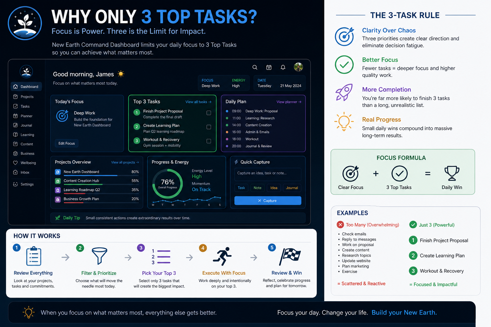

Top 3 is the emotional center of the app.

Use it to stop the day from dissolving into a long, guilty task list.

You can manage Top 3 from:

- `Planner`
- `Tasks`
- `Dashboard` for quick remove/done actions

How to use it well:

1. Choose tasks that would make the day feel meaningfully advanced
2. Avoid filling all three with tiny admin fragments unless that truly is the day
3. If a fourth task feels urgent, decide whether it replaces one of the three instead of adding silent overload

The app enforces a maximum of three.

When you hit the limit, that is not the system being annoying. It is the system protecting the day.

## Working During the Day

## Dashboard

Use the Dashboard when you need to reorient quickly.

The Dashboard is best for:

- checking today's focus
- seeing the current Top 3
- jumping into evening review
- using `Quick Capture`
- glancing at active projects

The Dashboard is not where you do all detailed management. It is your calm surface.

## Projects

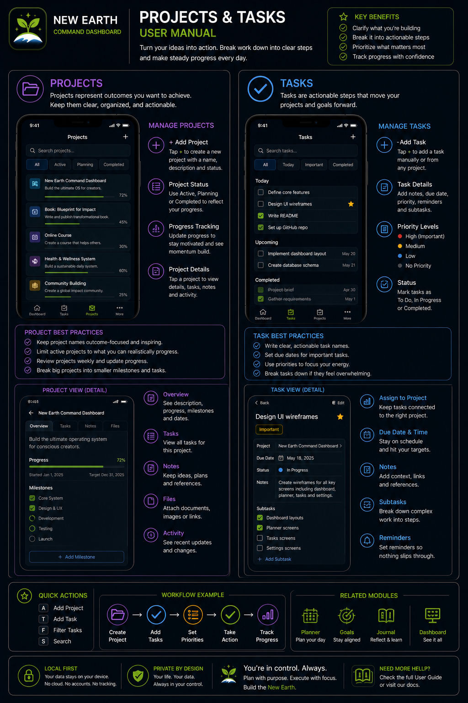

Use `Projects` when you need mission structure.

From the Projects screen you can:

- review seeded and created projects
- open a project detail page
- create a new project

From `Project Detail` you can:

- review project purpose and current state
- edit the project
- archive the project
- add a task linked to that project
- see active and blocked tasks
- see recent linked journal entries

When to use Projects:

- when you feel scattered and need the bigger picture
- when you need to decide which project deserves attention today
- when a task needs stronger context

## Tasks

Use `Tasks` when you need to manage action directly.

From the Tasks screen you can:

- create a task
- edit a task
- mark a task `Top 3`
- remove it from `Top 3`
- mark it `Done`
- `Move To Today`
- `Park`
- `Archive`
- filter by status
- filter by project
- search by title and notes

Suggested task workflow:

1. Capture tasks quickly without over-perfecting them
2. Move today's relevant tasks into `Today`
3. Promote only the most important ones into `Top 3`
4. Mark done or park calmly instead of mentally carrying every open loop

Status guidance:

- `Inbox`: captured, not yet shaped
- `Today`: relevant for today, but not necessarily Top 3
- `In Progress`: actively being worked on
- `Blocked`: cannot move yet
- `Done`: complete
- `Parked`: intentionally paused without shame

## Quick Capture and Inbox

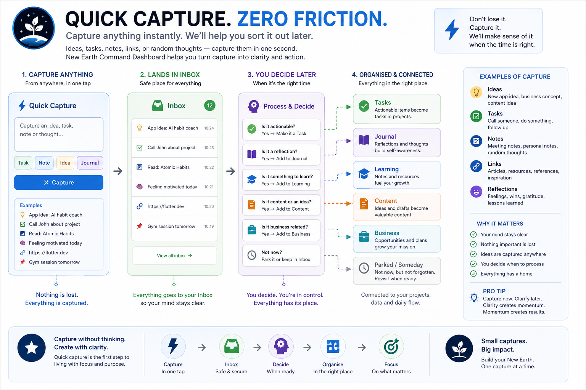

Use `Quick Capture` when you do not want to lose a thought and you also do not want to derail the task you are on.

Current quick capture flow:

1. Open `Dashboard`
2. Tap `Quick Capture`
3. Add a title, body, and optional type
4. Save
5. The item goes into `Inbox`

Use `Inbox` for:

- thoughts not yet sorted into the system
- fragments that matter but do not deserve immediate interruption
- future tasks, ideas, content seeds, or learning notes

Best habit:

- capture fast
- process later
- do not turn Inbox into another hidden guilt pile

## Planner

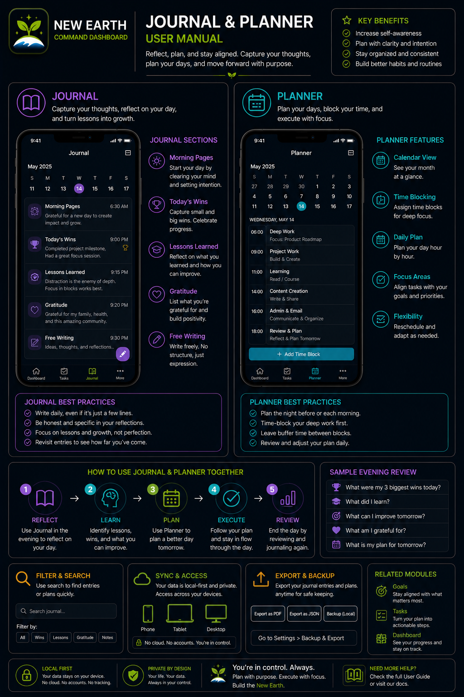

Use `Planner` when you want the full day structure rather than the Dashboard summary.

Current Planner supports:

- `Morning Intention`
- `Main Focus`
- `Why It Matters`
- Top 3 task selection
- `Evening Review`
- `Carry Forward`
- `Tomorrow's Focus`

Use Planner in two modes:

### Morning mode

Set the day's direction in one place.

### Evening mode

Complete the day before closing it.

You can reach the evening section directly by tapping `Start Evening Review` on the Dashboard.

## Evening Review

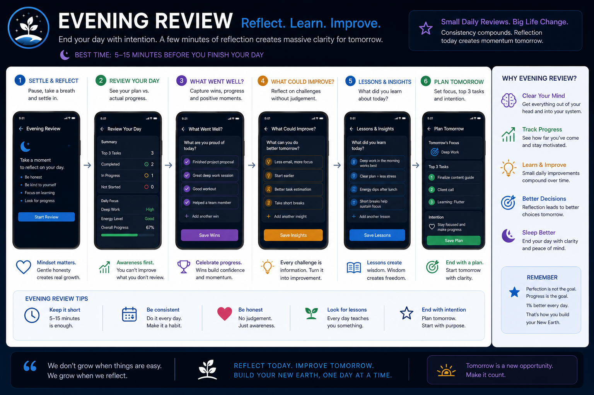

This is one of the most valuable habits in the app.

At the end of the day:

1. Open `Dashboard`
2. Tap `Start Evening Review`
3. Fill in:
   - `What moved forward today?`
   - `What did I complete?`
   - `What did I learn?`
   - `What blocked me?`
4. Add `Carry Forward`
5. Add `Tomorrow's Focus`
6. Save

What each field is really doing:

- `What moved forward today?`: progress, even if partial
- `What did I complete?`: finished units of work
- `What did I learn?`: useful insight, not just academic information
- `What blocked me?`: friction, constraints, confusion, or missing pieces
- `Carry Forward`: what still matters tomorrow
- `Tomorrow's Focus`: likely next anchor, while it is still fresh

This turns the app into a continuity system, not just a task system.

## Journal

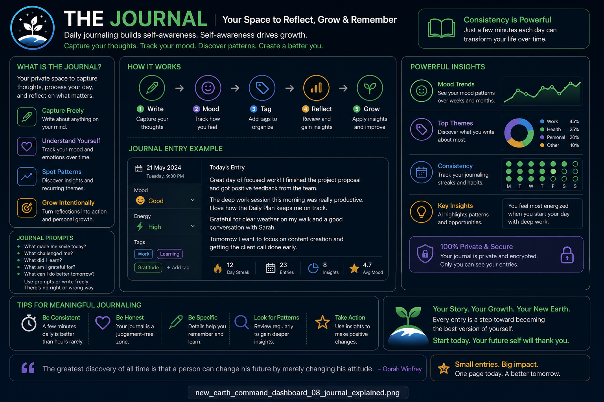

Use `Journal` to capture build history and decision memory.

Add a journal entry when:

- you shipped something
- you figured something out
- you hit a blocker
- you made a decision worth remembering
- you want material that may later become public writing

Current journal flow:

1. Open `Journal`
2. Tap `Add Entry`
3. Add title
4. Optionally link a project and task
5. Choose category
6. Write what you worked on, what you learned, and next actions
7. Save
8. Reopen any entry later by tapping it

The Journal is especially useful for:

- reconstructing progress after a messy week
- turning build work into content later
- staying honest about what actually moved

## Learning

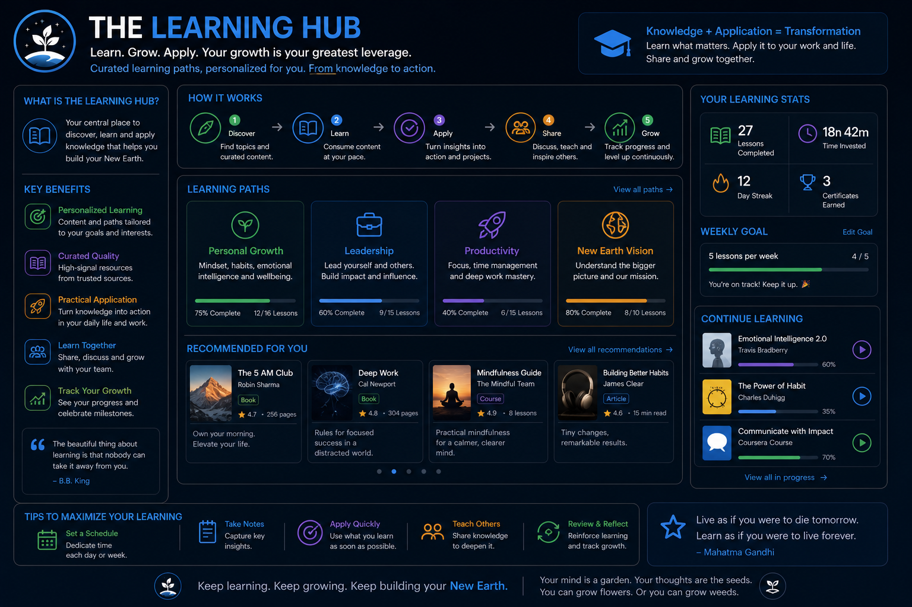

Use `Learning` to track skills that support actual building.

Do not treat it like a random reading backlog. Keep it connected to practical work.

Current learning flow:

1. Open `Learning`
2. Tap `Add Learning Topic`
3. Add topic
4. Optionally link a project
5. Add reason, resource, notes, confidence, and next step
6. Save
7. Reopen any item later by tapping it

Good examples:

- Flutter local database patterns
- Windows packaging workflow
- ESP32 diagnostics
- publishing flow for founder updates

Use the `Next Step` field aggressively. It keeps learning tied to action.

## Content

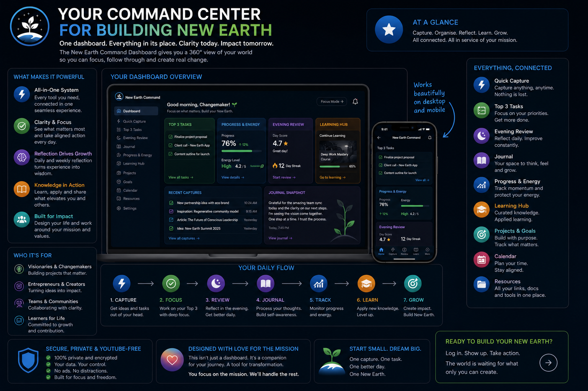

Use `Content` to turn build progress into public communication.

Current content flow:

1. Open `Content`
2. Tap `Add Content Idea`
3. Add title
4. Optionally link a project
5. Choose platform, type, and status
6. Add draft text
7. Mark whether an image is needed
8. Add image prompt and notes if useful
9. Save
10. Reopen any item later by tapping it

Good use cases:

- LinkedIn build updates
- website journal ideas
- founder journey posts
- technical update drafts

The content area works best when fed by Journal rather than by pressure.

## Business

Use `Business` for the practical support structure around the mission.

Current business flow:

1. Open `Business`
2. Tap `Add Opportunity`
3. Add the opportunity or action name
4. Optionally link a project
5. Choose type and status
6. Add company/contact, deadline, next step, follow-up date, link, and notes
7. Save

Use it for:

- job applications
- funding leads
- grants
- partnership conversations
- admin actions that move money or support

## Wellbeing

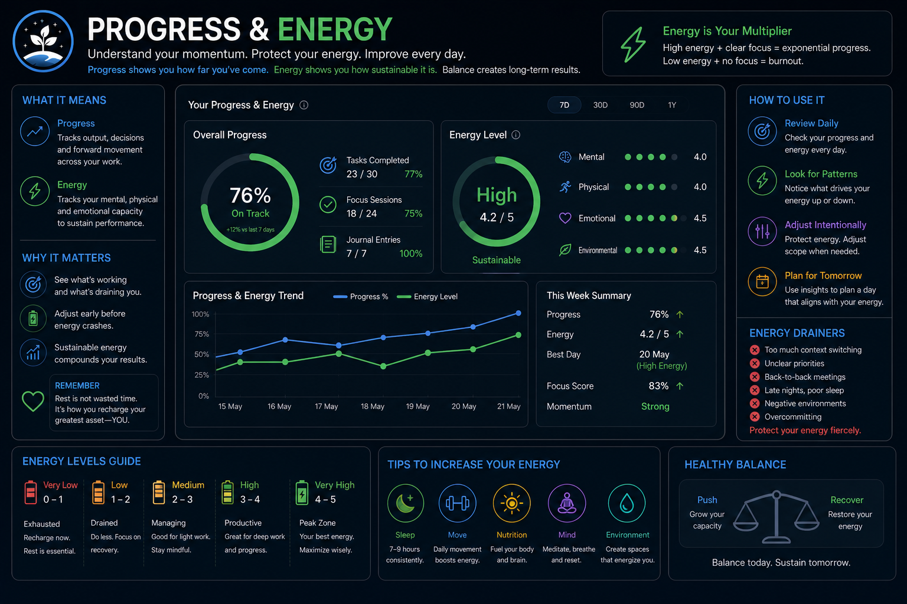

Use `Wellbeing` to stop the mission from eating the human running it.

Current wellbeing flow:

1. Open `Wellbeing`
2. Tap `Add Check-In`
3. Record energy, mood, sleep, and stress
4. Mark movement, food/water, and reflection
5. Add notes
6. Save

This is especially useful when:

- you keep overloading your days
- your energy and task ambition are drifting apart
- you want a gentler record of capacity over time

## Settings

Use `Settings` for lightweight control, not deep system configuration.

Current settings support:

- viewing the fixed Top 3 limit
- showing or hiding Dashboard support cards
- viewing app version

Recommended use:

- hide cards you are not actively using this season
- keep the Dashboard calm enough that you actually want to open it

## Suggested Daily Rhythm

If you want a practical routine to test right away, use this:

### Start of day

1. Open `Dashboard`
2. Set focus
3. Choose Top 3
4. Open `Projects` if you need mission context
5. Open `Tasks` and move the day into motion

### Midday reset

1. Return to `Dashboard`
2. Check whether the Top 3 still reflects reality
3. Use `Quick Capture` instead of context-switching
4. Park or rescope what no longer belongs to today

### End of day

1. Open `Start Evening Review`
2. Write the review honestly
3. Carry forward what still matters
4. Set tomorrow's likely focus
5. Add a Journal entry if the day included meaningful build progress or learning

## How Not to Use It

The app gets weaker if you use it like this:

- turning every thought into a high-priority task
- filling Top 3 with six mental priorities and three checkbox labels
- never parking anything
- letting Inbox become a forgotten graveyard
- writing Journal entries only when the day felt impressive

The app gets stronger if you use it like this:

- one real focus at a time
- honest daily review
- small but consistent capture habits
- linking work back to Projects
- using `Parked` and `Carry Forward` without self-punishment

## Best Visual References

If you want visual orientation while learning the app, these are the best current assets:

- Dashboard overview: `assets/user_guide/36_dashboard_user_manual_page.png`
- Projects and Tasks: `assets/user_guide/37_projects_tasks_user_manual_page.png`
- Planner and Journal: `assets/user_guide/38_journal_planner_user_manual_page.png`
- Quick start: `assets/user_guide/35_getting_started_quick_start.png`
- Mobile screen overview: `assets/screenshots/27_mobile_app_screens_overview.png`
- Daily planning flow concept: `assets/screenshots/28_daily_planning_flow.png`
- Project detail concept: `assets/screenshots/29_project_detail_screen_explained.png`

## Final Advice

Do not try to use every screen perfectly on day one.

For the first week, I'd recommend this minimal pattern:

1. Dashboard every morning
2. Top 3 every day
3. Quick Capture instead of mental overload
4. Evening Review every night
5. Journal only when something meaningful moved

That alone is enough to make the app start earning its place in your real workflow.
