# Visual Master Index

This page is the single entry point for the repo's visual library.

Use it to understand what has already been created, what each visual family is for, and which visuals are still missing or parked for later.

## Current Library

The repo currently has a broad visual set across documentation, design, and platform assets:

- Branding and identity visuals
- Architecture and system diagrams
- App screenshots and UI mockups
- User guide pages and onboarding visuals
- Repo-facing README and documentation graphics
- Module Hub and knowledge-fabric visuals
- Module gallery posters
- App store preview assets
- Desktop startup background
- Platform icons and launch images

## Featured

These are the four visuals most worth opening first:

Start here if you want the fastest tour of the core system and current release-ready visuals.

| Thumbnail | Visual |
| --- | --- |
| [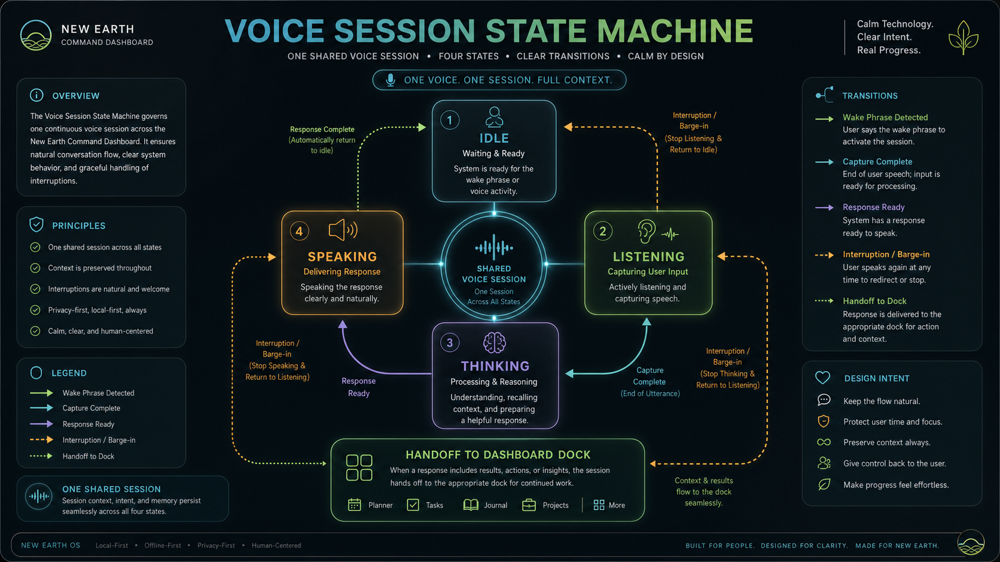](architecture/module_hub/visuals/voice_session_state_machine.png) | [Voice session state machine](architecture/module_hub/visuals/voice_session_state_machine.png) |
| [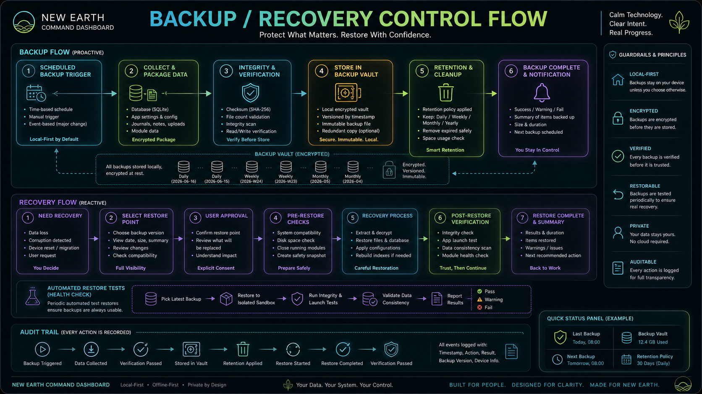](../assets/diagrams/backup_recovery_control_flow.png) | [Backup / recovery control flow](../assets/diagrams/backup_recovery_control_flow.png) |
| [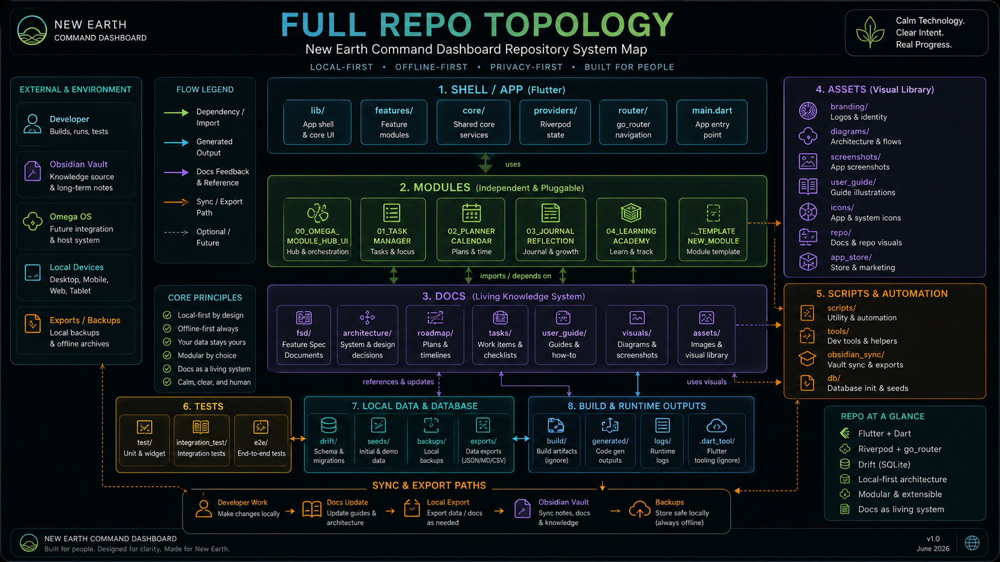](../assets/diagrams/full_repo_topology.png) | [Full repo topology](../assets/diagrams/full_repo_topology.png) |
| [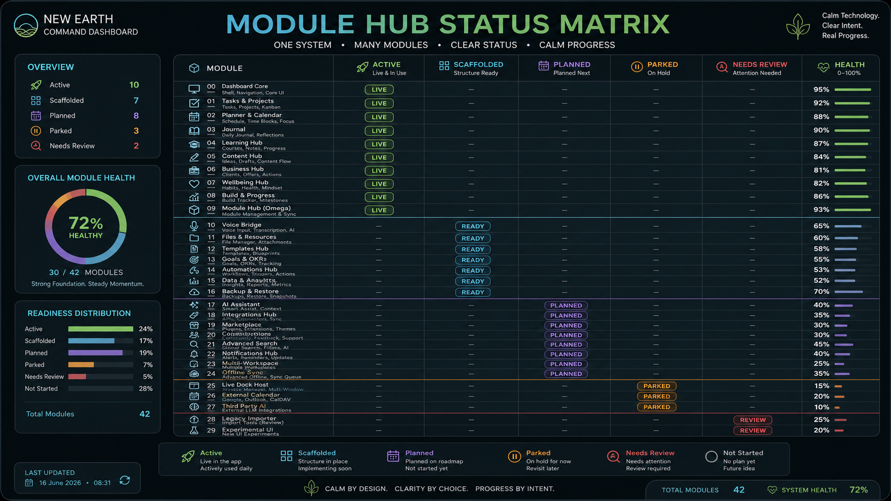](architecture/module_hub/visuals/module_hub_status_matrix.png) | [Module Hub status matrix](architecture/module_hub/visuals/module_hub_status_matrix.png) |

## Gallery

### Core System

These diagrams explain how the main local-first dashboard layers and voice/session flows fit together.

| Thumbnail | Visual |
| --- | --- |
|  | [Voice session state machine](architecture/module_hub/visuals/voice_session_state_machine.png) |
|  | [Backup / recovery control flow](../assets/diagrams/backup_recovery_control_flow.png) |
|  | [Full repo topology](../assets/diagrams/full_repo_topology.png) |
| [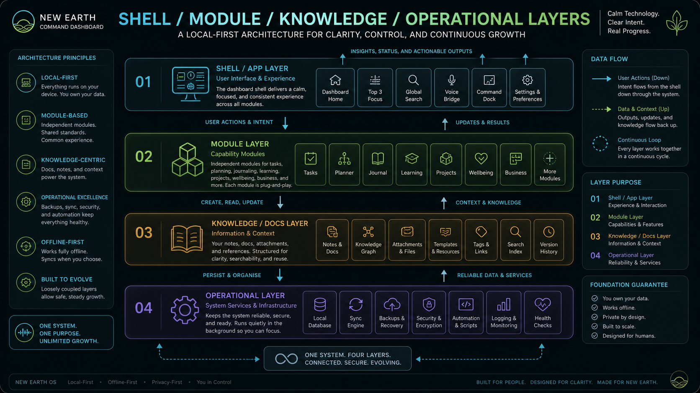](../assets/diagrams/shell_module_knowledge_operational_layers.png) | [Shell / module / knowledge / operational layers](../assets/diagrams/shell_module_knowledge_operational_layers.png) |
| [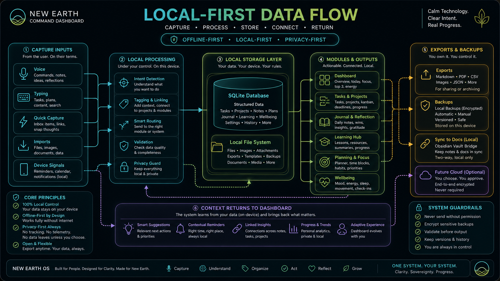](../assets/diagrams/local_first_data_flow.png) | [Local-first data flow](../assets/diagrams/local_first_data_flow.png) |
| [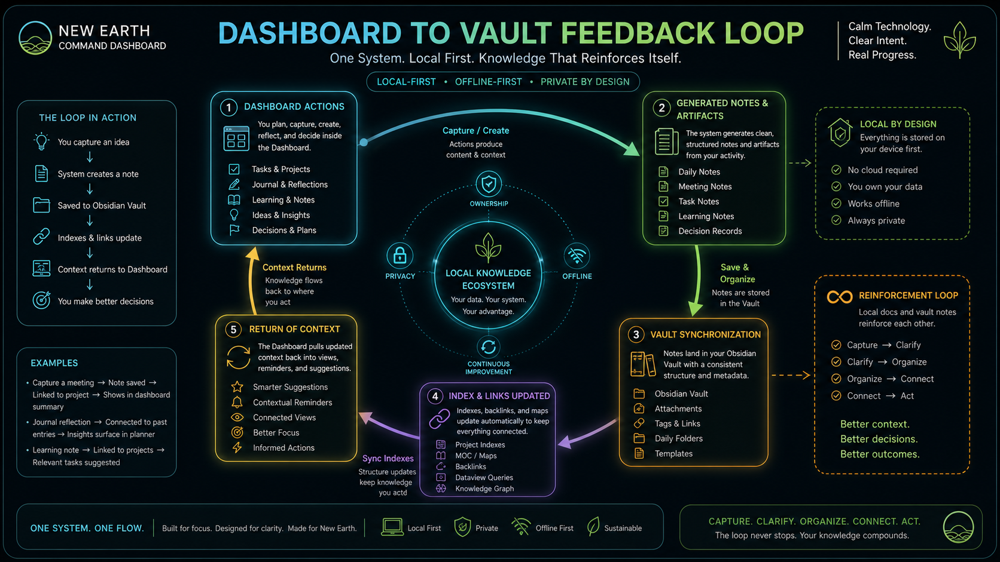](../assets/diagrams/dashboard_to_vault_feedback_loop.png) | [Dashboard to vault feedback loop](../assets/diagrams/dashboard_to_vault_feedback_loop.png) |
| [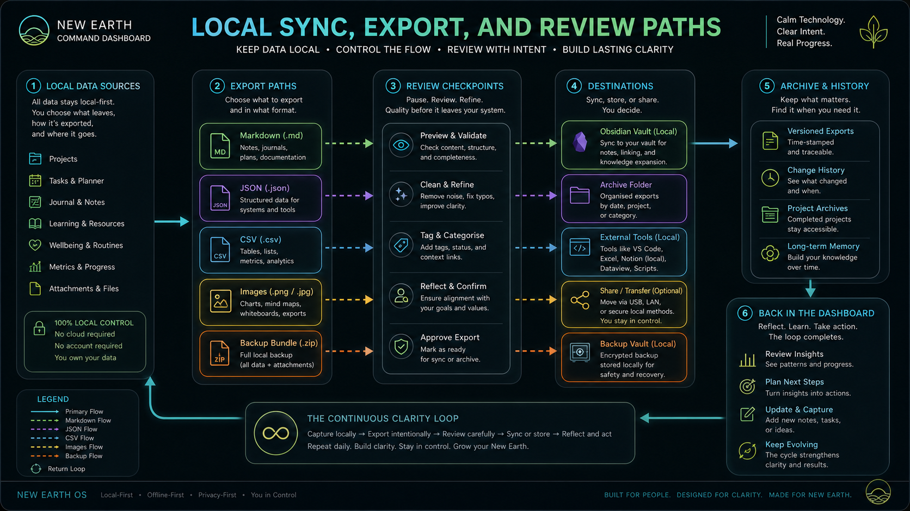](architecture/module_hub/visuals/local_sync_export_review_paths.png) | [Local sync, export, and review paths](architecture/module_hub/visuals/local_sync_export_review_paths.png) |

### Module And Operational

These visuals cover module health, sync support, documentation flow, and release readiness.

| Thumbnail | Visual |
| --- | --- |
|  | [Module Hub status matrix](architecture/module_hub/visuals/module_hub_status_matrix.png) |
| [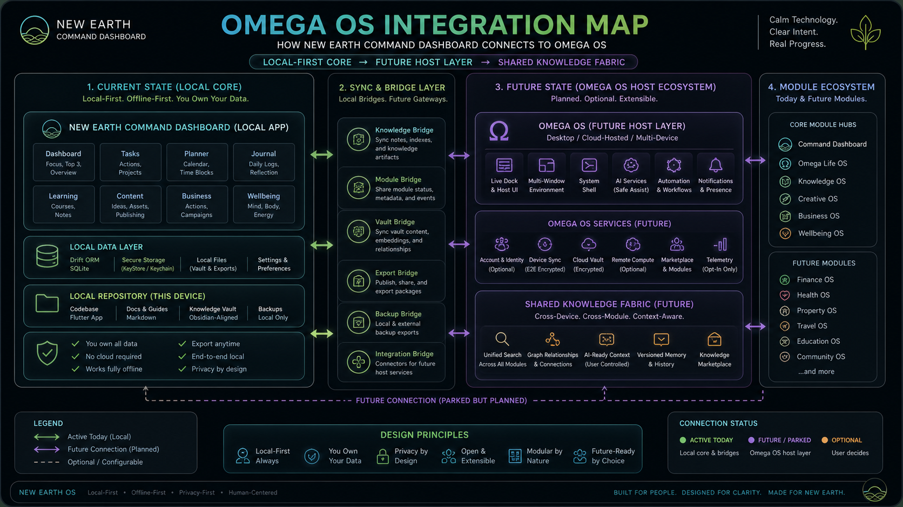](../assets/diagrams/omega_os_integration_map.png) | [Omega OS integration map](../assets/diagrams/omega_os_integration_map.png) |
| [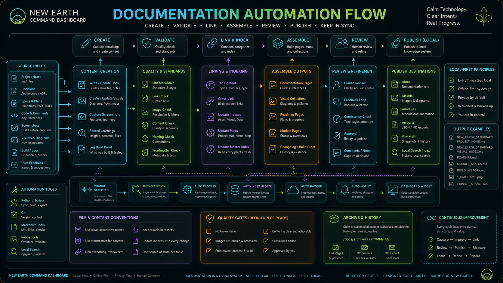](roadmap/images/documentation_automation_flow.png) | [Documentation automation flow](roadmap/images/documentation_automation_flow.png) |
| [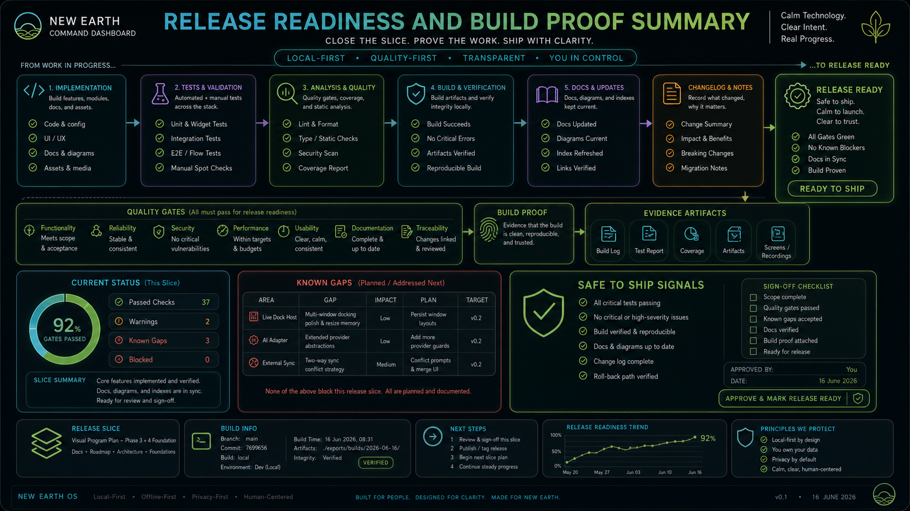](roadmap/images/release_readiness_build_proof_summary.png) | [Release readiness and build proof summary](roadmap/images/release_readiness_build_proof_summary.png) |

### Future Concepts

These are parked concepts for later slices, kept here as high-quality references rather than active build targets.

| Thumbnail | Visual |
| --- | --- |
| [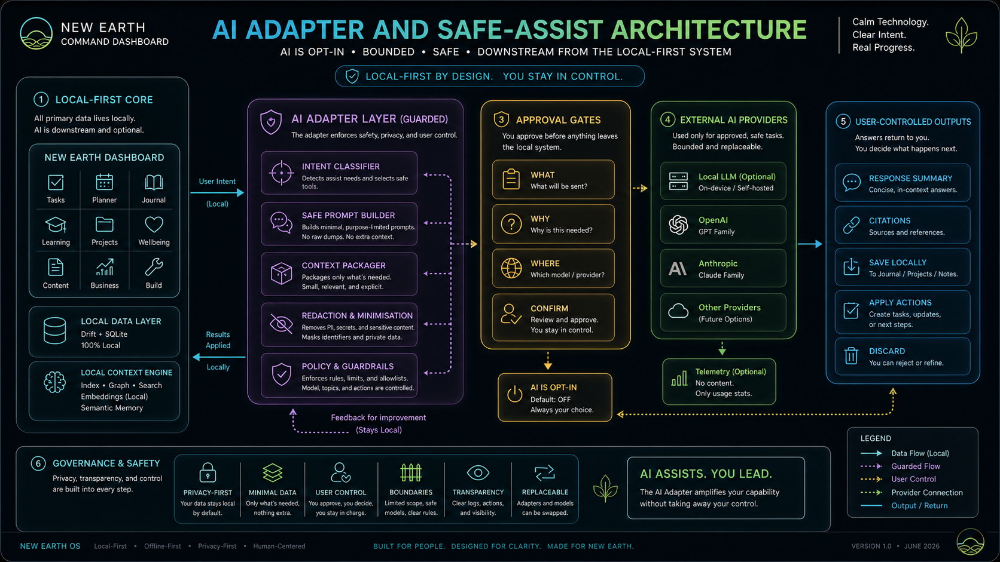](../assets/diagrams/ai_adapter_safe_assist_architecture.png) | [AI adapter and safe-assist architecture](../assets/diagrams/ai_adapter_safe_assist_architecture.png) |
| [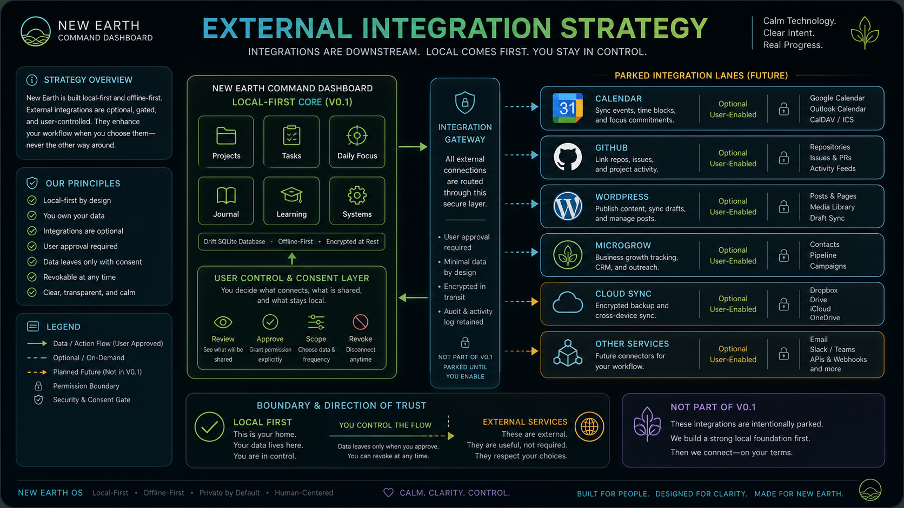](../assets/diagrams/external_integration_strategy.png) | [External integration strategy](../assets/diagrams/external_integration_strategy.png) |
| [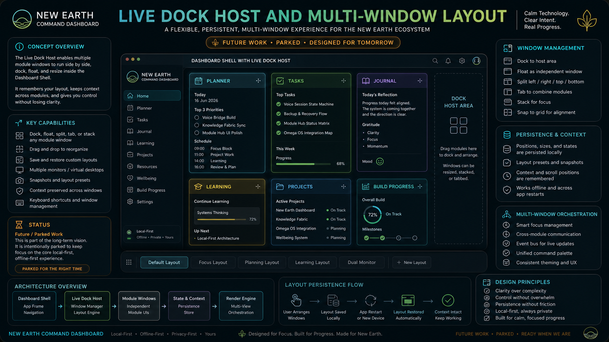](../assets/diagrams/live_dock_host_multi_window_layout.png) | [Live dock host and multi-window layout](../assets/diagrams/live_dock_host_multi_window_layout.png) |
| [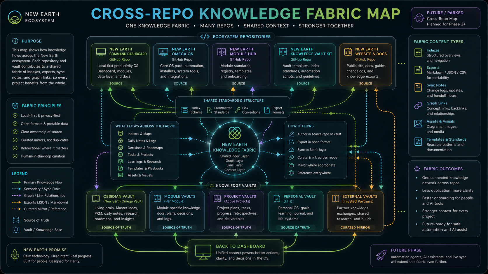](../assets/diagrams/cross_repo_knowledge_fabric_map.png) | [Cross-repo knowledge fabric map](../assets/diagrams/cross_repo_knowledge_fabric_map.png) |
| [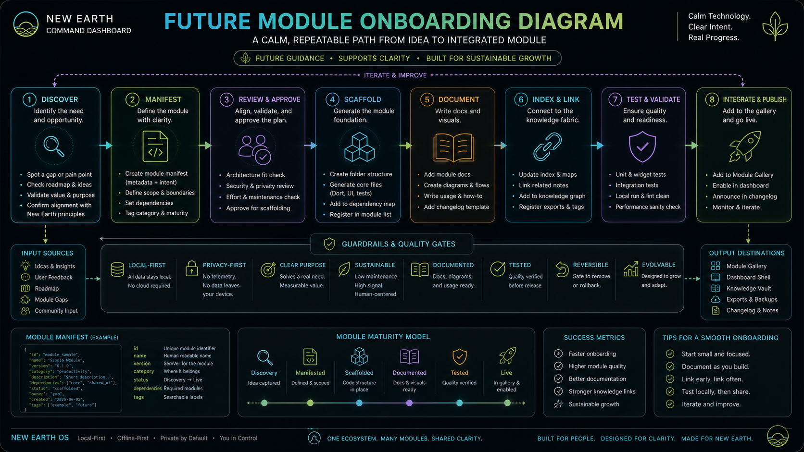](../assets/diagrams/future_module_onboarding_diagram.png) | [Future module onboarding diagram](../assets/diagrams/future_module_onboarding_diagram.png) |

### Docs and design assets

- `assets/branding` - 8 assets
- `assets/diagrams` - 21 assets
- `assets/screenshots` - 12 assets
- `assets/user_guide` - 17 assets
- `assets/repo` - 6 assets
- `assets/tutorials` - 1 asset
- `assets/app_store` - 1 asset
- `assets/alternatives` - 2 assets

## Asset Breakdown

### Repo visual families

- `docs/architecture/module_gallery/visuals/` - 21 module posters
- `docs/architecture/module_hub/visuals/` - 6 core Module Hub and knowledge-fabric images
- `docs/architecture/module_hub/visuals/build_proof/` - 5 historical build-proof images
- `docs/roadmap/images/` - 1 roadmap image

### Platform runtime images

These are not documentation visuals, but they are part of the repo's image set:

- `android/app/src/main/res/`
- `ios/Runner/Assets.xcassets/`
- `macos/Runner/Assets.xcassets/`
- `linux/flutter/ephemeral/`
- `web/icons/`

## What Is Stable

These visual families are already in good shape and should be kept current:

- Core architecture overview, database, and local-first privacy diagrams
- Module Hub architecture, status, and knowledge-fabric sync diagrams
- The module gallery overview set for major active modules
- User guide pages for dashboard, tasks, planner, journal, learning, and quick start
- Repo-facing visuals for the README, docs folder map, MVP roadmap, and feature checklist

## Recently Rendered

This pass filled the previously missing visuals in the current plan, and they now appear in the gallery above.

## Recommended Order

If we are extending the visual library from here, keep the next order as maintenance or refinement work:

1. Refresh the core diagrams if the architecture changes.
2. Add narrower module-specific posters only when a new active module appears.
3. Add new future concept art only when a future slice becomes real enough to justify it.

## Where To Look Next

- [Architecture Visual Index](architecture/visual_index.md)
- [Asset Index](assets/asset_index.md)
- [Visual Program Plan](roadmap/visual_program_plan.md)
- [Visual Project Map](roadmap/visual_project_map.md)

## Notes

- The architecture index is still the best place for the technical diagram family.
- The asset index is still the best place for the raw PNG inventory.
- This page ties those views together and makes the missing work explicit.
