# Users & Devices Control - User Guide

Local security layer for identities, devices, approvals, and audit.

## What it does

Use this module to check whether a user or device can open a sensitive dashboard area.

It manages:

- users
- devices
- roles
- permissions
- trust levels
- local PIN records
- approvals
- audit events

The module home now also shows a short access plan so the main security flow is easy to read at a glance.

The main app now opens on `Security Lock` first. That screen uses the New Earth desktop startup image in the background, then lets you continue into the dashboard or the optional voice gate.

A small opaque security session box now sits in the top-left corner of the desktop shell. It shows whether the session is active, the active user, whether that user is online, the timeout window, and a live countdown to expiry. You can tap it to return to `Security Lock` or jump to `Access Matrix`.

The local PIN registry now lives inside the same security area. Use `PIN Registry` from `Users & Devices Control` or `Settings` when you need to set, revoke, or recover a local PIN. The lock screen no longer opens the registry directly.

The PIN registry now stores records in the local SQLite database first, with the seeded JSON files acting as the fallback demo source. That keeps per-user PIN changes, recovery codes, and audit flow local while the rest of the access store catches up.

The local access store now also proves three safety points more clearly during support work:

- repeated repository loads do not duplicate seeded users, devices, approvals, or audit rows
- PIN records and lockout state survive a fresh local service reload
- `Migration health` reflects the real SQLite table posture and live row counts, including PIN records and lockouts

If you already had a local PIN saved before the database switch, the app will import that legacy PIN file into SQLite the first time the registry loads. That keeps existing demo PINs and personal test PINs working during the transition.

The current PINs now show in two places:

- each user card in `Users` shows the active and recovery PIN summaries for that person
- `Security Lock` shows the selected user’s masked PIN summaries before unlock

That makes it easier to check the right person before you test a PIN.

`Security Lock` also highlights a recommended local identity when the selected user is not the best match for the screen you are trying to open.
That gives you a clearer first choice before you start typing a PIN.

When the app is locked, the `Users & Devices` area stays open, but `PIN Registry` is blocked until a local session is unlocked. Everything else redirects back to `Security Lock`.

The module home now also includes an `Access review dashboard`. That gives you one calm review surface for lockouts, recovery pressure, quarantined devices, pending approvals, and recent denied unlocks.

`Approval Queue` now includes a triage summary so you can spot stale, risky, or blocked approval requests before you open every card one by one.

## Access System

Use these diagrams when you want to understand the full access flow quickly.

### 1. Access flow

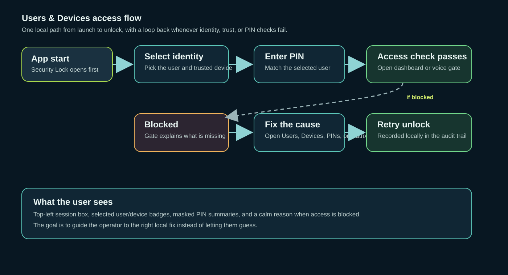

This shows the exact route from app start to unlocked screen. If a check fails, the flow loops back to the right place instead of letting the screen open.

### 2. Roles and permissions

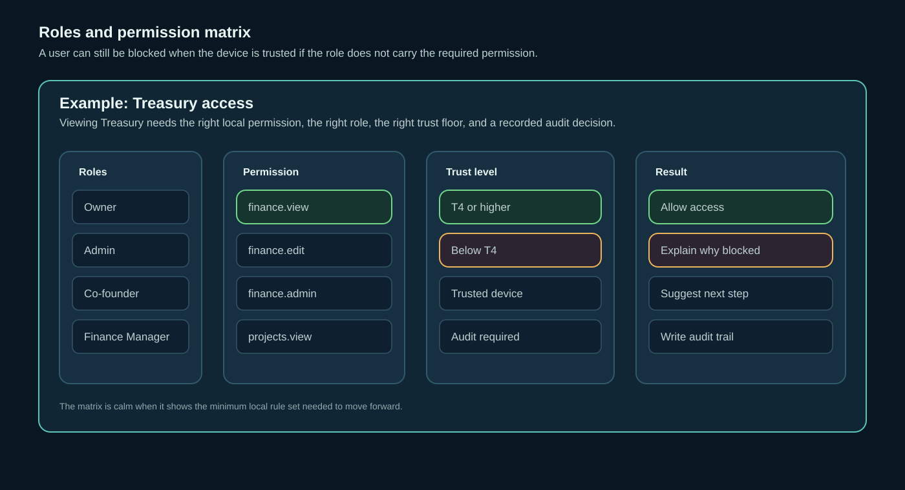

This shows why a user can be blocked even when the device is trusted. The Hayley example is a good reminder that role and permission still matter.

### 3. Session lifecycle

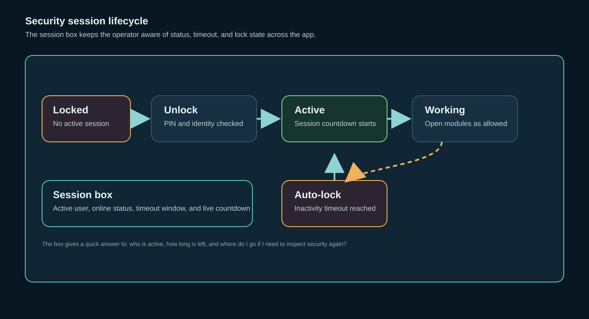

This shows how the session box, countdown, active user, and auto-lock behave across the app.

## Focused access diagrams

Use these when you want a closer look at the parts people ask about most.

### 1. User onboarding

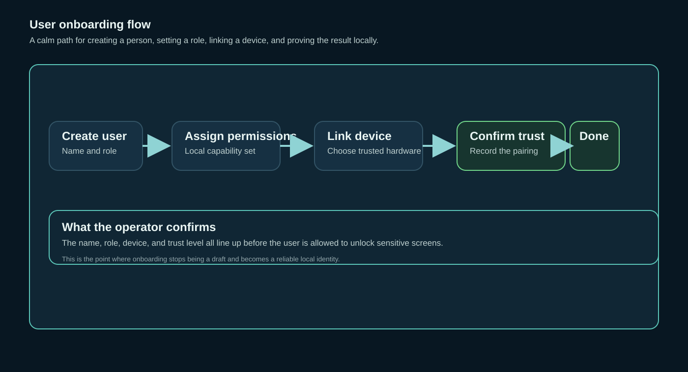

This shows the path from a new user record to trusted access.

### 2. Device trust

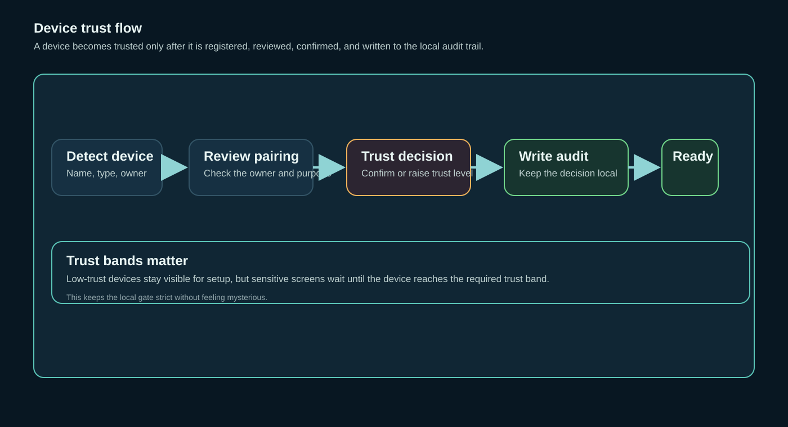

This shows how a device moves from detected to trusted and ready for gated access.

### 2a. Device quarantine and restore

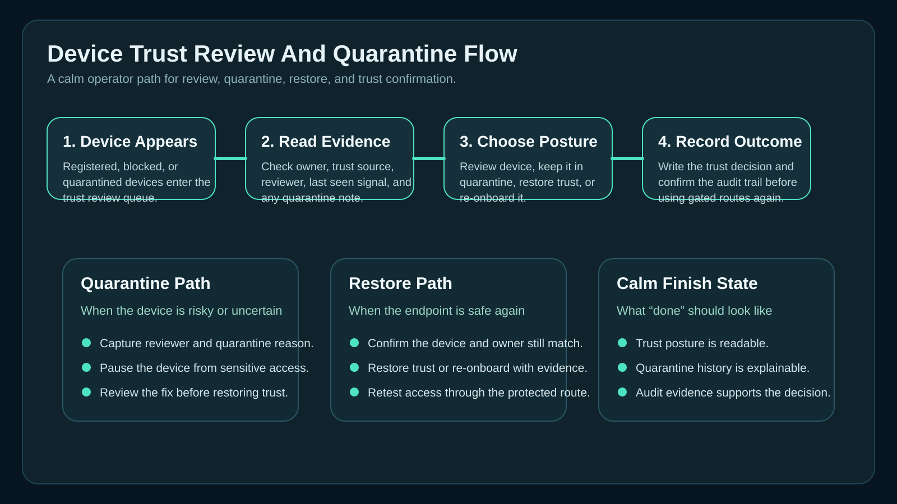

This shows the operator path for reviewing a risky endpoint, quarantining it, restoring it, and confirming the audit trail.

### 3. PIN assignment and recovery

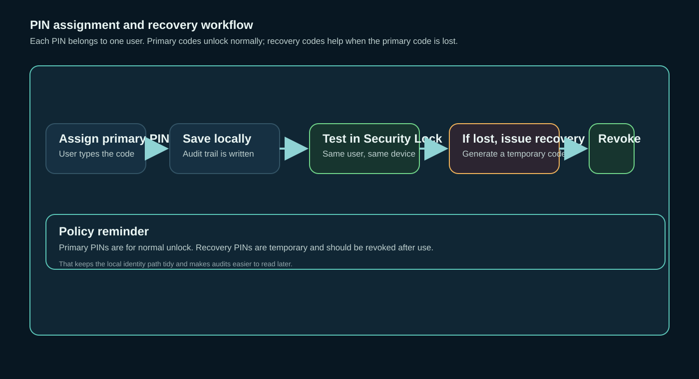

This shows how a PIN is assigned, confirmed, stored locally, and recovered safely.

## Onboarding report visuals

Use these when you want a calmer admin-ready view of onboarding status and a print-friendly handoff reference.

### 1. Onboarding readiness map

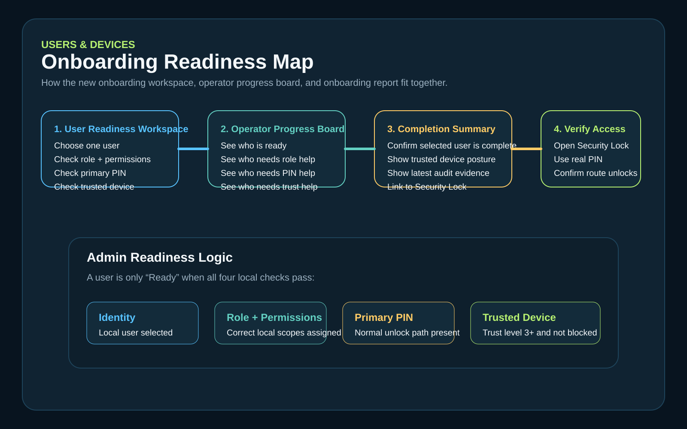

Rendered version:

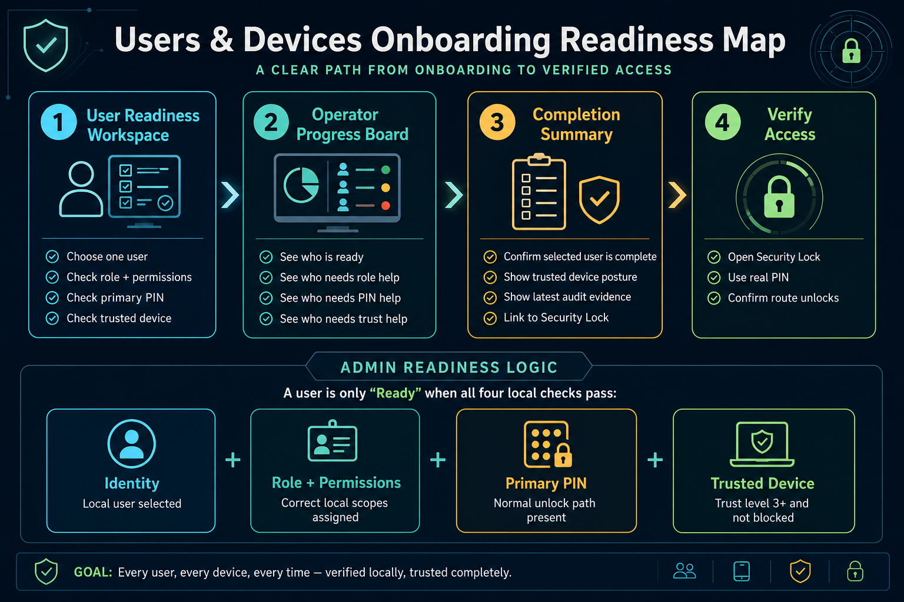

What it shows:

- the quickest path from user creation to trusted unlock
- where role, PIN, trust, and audit checks sit
- the difference between `Ready`, `Needs PIN`, `Needs trust`, and `Needs role`

### 2. Handoff cheat sheet

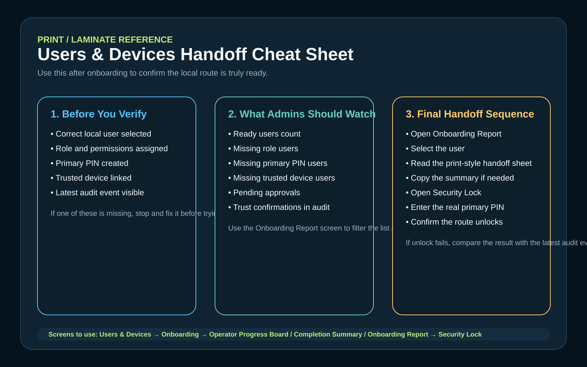

Rendered version:

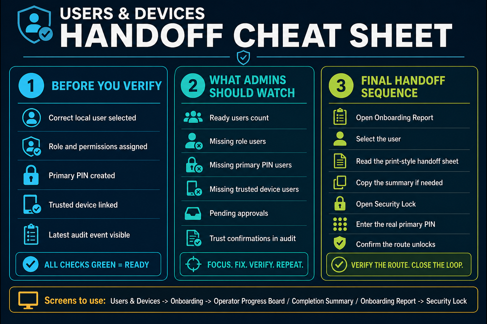

What it shows:

- the operator handoff path
- the unlock test path
- the recovery path when a user loses a PIN
- the fastest admin checks before a sensitive route is tested

### 3. Printable pack

A PDF-ready pack is now also included for printing and laminating:

- `output/pdf/users_devices_onboarding_pack.pdf`

That pack combines the readiness map and the handoff cheat sheet into a clean two-page reference.

### 4. Recovery drills pack

Use this second pack when you want the admin drill version focused on lost PINs and device trust recovery:

- `output/pdf/users_devices_recovery_drills_pack.pdf`

Preview pages:

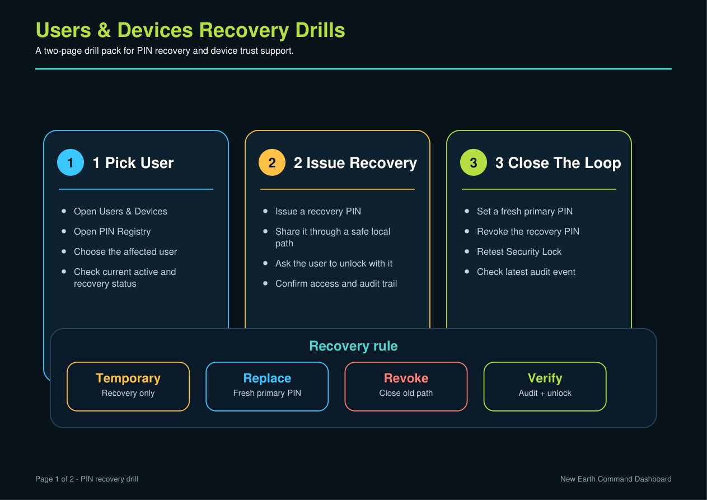

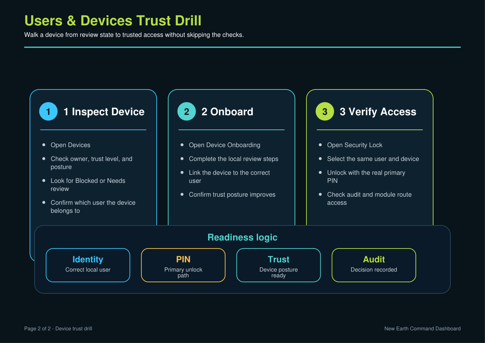

### 5. Access review dashboard map

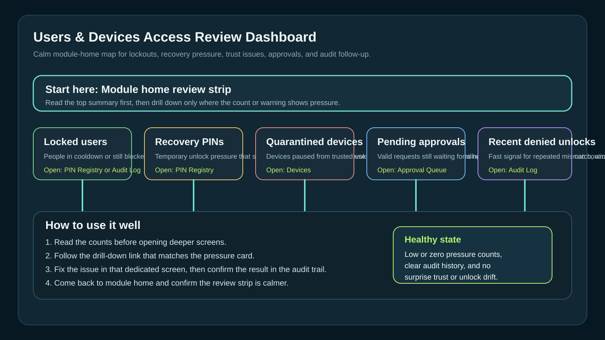

This shows how the module home review cards link back into approvals, PINs, devices, and audit work.

### 6. Approval triage map

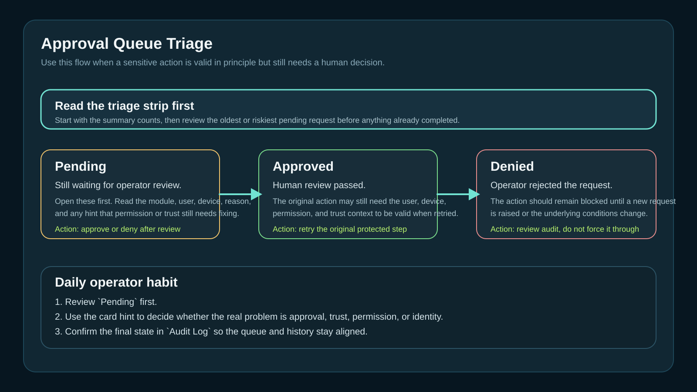

This shows how to read `Pending`, `Approved`, and `Denied` states without guessing which queue item needs attention first.

## Startup flow

Use this flow when you want to understand how the app opens now:

1. Launch the app.
2. Review `Security Lock`.
3. Pick the local user and device.
4. Unlock into the dashboard, or into the voice gate if that option is turned on.
5. Open `Settings` if you want to show or hide the voice startup gate.
6. Use the top-left session box to check the live countdown, active user, and online status during testing.

Quick checks:

- `Active user` should match the person you just unlocked with
- `Status: online` should appear when the local session is active
- The countdown should keep moving once per second

## Start here

If you are opening the module for the first time, do this first:

1. Open `Users & Devices Control`.
2. Click `Reset demo data`.
3. Open `Users` and confirm `Hayley Arthur` exists.
4. Open `Devices` and confirm `NEW_EARTH_DEV` exists.
5. Open `Access Matrix` and confirm Treasury needs finance permission plus the trust floor.
6. Open the Treasury gate with the seeded user and device.
7. Check `Audit Log` after the decision.
8. If the voice startup gate is enabled, continue there next and confirm the headset check appears after the lock screen.

## Core rule

Before a sensitive module opens, the system needs:

- identity
- role
- permission
- trust level
- audit trail
- local PIN, when the lock is enabled

If anything is missing, the gate should explain what is missing and why.

The startup lock is the first check. The voice gate is optional and should only be used when you want the headset readiness step at startup.

## PIN Registry

Use `PIN Registry` when a user has lost their local PIN or when you want to rotate it. It is only available after the main Users & Devices screen or Settings is open.

Visual reference:

- `docs/assets/pin_onboarding_confidence_flow.svg`

You can also assign a PIN directly from an individual user card in `Users`.
That card shows the PIN counts for that person, such as `Primary PIN 1` or `Recovery PIN 1`.
Use `Assign PIN` on the card for the fastest path:

- choose `Primary` to type a manual unlock PIN
- choose `Recovery` to generate a recovery code automatically

Each PIN record is tied to one user only, so the unlock check always compares the selected user with that user's saved PINs.
If the session locks again, the PIN Registry closes back to `Security Lock`.

PIN policy:

- keep PINs local and user-specific
- keep one active primary PIN per user
- keep recovery PINs temporary and issue a fresh one when needed
- use 4 to 8 digits for the normal unlock code
- use a recovery PIN only when the primary PIN is unavailable
- revoke recovery PINs after use
- keep the audit trail visible for each change

It supports:

- set primary PIN
- issue recovery PIN
- revoke all PINs for a user
- revoke a single PIN record
- review the `Recovery & reset queue`
- follow the `Governed reset checklist`
- read the `Recovery rotation guidance` panel
- inspect the per-user `PIN event timeline`

When to use it:

- the user cannot remember the current unlock PIN
- you want to replace a shared demo PIN with a personal one
- you want to retire an old code after recovery

Click-by-click:

1. Open `Users & Devices Control`.
2. Click `Manage PINs` from `Users & Devices Control` or `Settings`.
3. Pick the user.
4. Read `Recovery & reset queue` first if the user is locked out or missing a primary PIN.
5. Read `Admin reset flow` for the current lockout, primary, and recovery posture.
6. Follow `Governed reset checklist` so identity verification, recovery issuance, forced reset, and revoke steps happen in the right order.
7. Check `Recovery rotation guidance` to see whether a live recovery PIN should now be revoked or rotated away.
8. Set a primary PIN or issue a recovery PIN.
9. Use `Security Lock` to test the new PIN.
10. Review `PIN event timeline` to confirm the local audit trail recorded the reset, recovery, or lockout path cleanly.
11. Revoke the old or temporary PIN once the user is back in.

## Quick operator flow

Use this when you want the fastest safe path from user card to test unlock.

1. Open `Users`.
2. Find the person you want to work with.
3. Click the user's PIN summary chip to open `PIN Registry` already pointed at that user.
4. Or click `Copy PIN summary` if you want a quick local note for yourself.
5. Set or rotate the primary PIN, or issue a recovery PIN if needed.
6. Open `Security Lock`.
7. Select the same user and matching device.
8. Enter the new PIN and unlock.
9. Check `Audit Log` to confirm the change was recorded locally.

## Onboarding report screen

Use `Onboarding Report` when you want one place to review user readiness, handoff status, and the print-style summary.

Where to find it:

1. Open `Users & Devices Control`.
2. Click `Onboarding Report` from the module home.
3. Or open `Device Onboarding` and click `Open onboarding report`.

What it does:

- shows readiness counts for active users
- adds a broader `Readiness dashboard` for active, blocked, archived, and exception-only posture
- lets you filter by status
- lets you focus the report on one user
- builds a print-style handoff sheet
- gives you a quick `Copy summary` action for local notes or admin handoff
- lets you `Export readiness` to a saved local markdown handoff file
- lets you `Export review pack` to bundle readiness, approval pressure, and audit posture together
- lets you generate `Readiness PDF` and `Review pack PDF` when you want printable local copies

Status meanings:

- `Ready`: user has role coverage, a primary PIN, a trusted device, and recent audit context
- `Needs PIN`: the user still needs a primary unlock PIN
- `Needs trust`: the linked device is not trusted enough yet
- `Needs role`: the user still lacks the role or permission shape expected for the workflow
- `Blocked`: the user is carrying a blocked or quarantined device path
- `Archived`: the user record is still visible for context, but is no longer active onboarding work
- `Exceptions`: the user looks structurally ready, but still carries denied, pending, or recovery-heavy follow-up

Quick test:

1. Open `Onboarding Report`.
2. Pick Peter or Hayley as the focused user.
3. Change the filter and confirm the user cards move between groups correctly.
4. Click `Copy summary`.
5. Paste the result into a note to confirm the handoff sheet text is complete.
6. Click `Export readiness` to save a local report into the Users & Devices export folder.
7. Click `Export review pack` when you want one broader admin handoff pack instead of a single-user readiness summary.
8. Click `Readiness PDF` or `Review pack PDF` when you want a print-ready version straight away.

## Access review dashboard

Use `Access review dashboard` when you want the fastest health check for the local trust system without jumping through every admin tab first.

Where to find it:

1. Open `Users & Devices Control`.
2. Stay on the module home screen.
3. Look for the review panel with summary cards and drill-down actions.

What it shows:

- locked or cooling-down users
- active recovery PIN pressure
- quarantined or revoked trust devices
- pending approvals
- recent denied unlock signals
- direct export actions for `Incident summary`, `Review pack`, and `Review pack PDF`

What to do with it:

1. Open the module home.
2. Check whether any summary count looks unexpectedly high.
3. Use the matching drill-down button.
4. Confirm the deeper screen opens already focused on the right admin area.
5. Review `Audit Log` after any recovery, unlock, revoke, or approval action.
6. Use `Export incident` or `Export review pack` when you want a saved admin handoff without opening deeper screens first.
7. Use `Review pack PDF` when you want a print-ready local copy.

Use this screen first when:

- a user says they still cannot get in after a reset
- you suspect trust drift across multiple devices
- you want a quick daily admin review
- you want to confirm the system is calm before finance or treasury testing

## Audit Log

Use `Audit Log` when you need more than a flat event list.

What is new in this reporting pass:

- `Latest risk panel` highlights failed unlocks, repeated denials, stale trust, and approval backlog
- `Grouped audit view` breaks the trail down by user, device, module, and action family
- grouped cards now also show the hottest denied user, device, module, and action family first
- the event list still stays underneath for detailed review
- `Export incident` writes a calmer local incident summary for handoff or review
- `Export review pack` writes one combined markdown pack with readiness posture, approval pressure, grouped audit pressure, and latest matching events
- `Incident PDF` and `Review pack PDF` generate print-ready local versions of those exports

Quick audit review:

1. Open `Audit Log`.
2. Read `Latest risk panel` first.
3. Check `Grouped audit view` to see whether one actor, device, or module is dominating the trail.
4. Use search or result chips to narrow the event list.
5. Open the related admin screen only after the grouped view tells you where the pressure is.
6. Click `Export incident` when you want a saved local markdown summary of the current audit posture.
7. Click `Export review pack` when you want a broader admin handoff file instead of just the incident slice.
8. Click the grouped audit filter buttons when you want the event list narrowed straight to one user, device, module, or action family.

## Migration Health

Use `Migration Health` when you want one support-facing view of the SQLite-first Users & Devices posture.

What it shows:

- whether the module is attached to SQLite
- where the local database file lives
- which tracked Users & Devices tables exist and how many rows they hold
- which seed and config files still exist for fallback support

Quick migration check:

1. Open `Users & Devices Control`.
2. Click `Migration Health`.
3. Confirm `Database mode` reads as `SQLite attached`.
4. Check `Database file` to confirm the local file path is present.
5. Review `Tracked tables` for row counts across users, devices, approvals, audit, and PIN storage.
6. Review `Tracked seed and config files` before any reset or local support handoff.

## Assign a PIN to one user

Use this when you want to give one person their own local unlock code.

1. Open `Users & Devices Control`.
2. Open `Users`.
3. Find the person you want to update.
4. Click `Assign PIN` on that user's card.
5. Leave `Primary` selected if you want to type a normal unlock PIN yourself.
6. Enter a 4 to 8 digit PIN that only that person should use.
7. Save the PIN and watch the card update to show the new PIN count.
8. Or switch to `Recovery` if you want the app to generate a recovery code for you.
9. Open `Security Lock`.
10. Select the same user.
11. Enter the new PIN and unlock the session.
12. Check `Audit Log` if you want to confirm the change was written locally.

What this does:

- creates or replaces the active PIN for only that selected user
- revokes any older active primary PIN for that user
- keeps the PIN bound to the selected local identity
- leaves other users' PINs untouched
- records the change in the local audit trail

## Recover a lost PIN

Use this when the user still exists but the active PIN was lost or needs a safe replacement.

1. Open `Users & Devices Control`.
2. Open `PIN Registry`.
3. Pick the affected user.
4. Click `Issue recovery PIN`.
5. Share the recovery code with the user through a safe local path.
6. Ask the user to unlock with that recovery PIN.
7. Once the user is back in, revoke the recovery PIN.
8. If needed, set a fresh primary PIN after the recovery has been confirmed.

What to keep in mind:

- the recovery PIN is still tied to one user only
- the recovery PIN is generated automatically in the dialog
- issuing a new recovery PIN replaces the previous recovery path for that user
- the recovery PIN should be revoked after use
- if the user forgets the PIN again, issue a fresh recovery code rather than reusing an old one
- the audit log should show both the issue and the revoke events

## Force reset a primary PIN

Use this when the user still exists, identity has been checked, and you need to replace the normal unlock PIN directly.

1. Open `Users & Devices Control`.
2. Open `PIN Registry`.
3. Pick the affected user.
4. Read `Admin reset flow`.
5. Follow `Governed reset checklist`.
6. Click `Force reset primary PIN` or `Set primary PIN`, depending on the posture shown.
7. Enter the replacement primary PIN.
8. Add the force-reset reason when prompted.
9. Test the new PIN through `Security Lock`.
10. Review `PIN event timeline`.

What this means in practice:

- recovery PIN issuance is separate from a primary reset
- lockout timer clearance is separate from both
- every reset needs a reason for the audit trail
- the safest finish state is one active primary PIN and no lingering recovery PIN

## Seed demo PIN

The current seeded demo data includes this default local PIN for Peter Ellis:

- Primary PIN: `2468`
- Recovery PIN: generated in the seed file and shown masked in the app until you issue a new one

If you have already changed Peter's PIN in the live app, your local database will override the seed example. In that case, use `PIN Registry` to inspect the current record, then test the same user on `Security Lock`.

## Next access-control task

The next calm step is to keep tightening the Users & Devices access flow now that the live store is already SQLite-first.

Why this is next:

- it matches the current future roadmap
- it keeps the access story calm and consistent for operators
- it makes per-user PIN, approval, and audit data easier to understand
- it gives the access system a cleaner foundation before PIN/passkey expansion

## Treasury example

Treasury is a good example because it is a sensitive finance area.

Current rules:

- `finance.view` for viewing
- `finance.edit` for editing
- `finance.admin` for the most sensitive finance control
- trust level `4` or higher for module access
- approval for actions like `delete_record`, `export_data`, and `change_bank_details`

Seeded example data:

- `Hayley Arthur` is a `Co-founder` with finance view/edit access
- `NEW_EARTH_DEV` is a trusted local device with trust level `4`

## How to use the seed demo

Use the seed demo when you want a safe local test setup without building records by hand.

### Seed a sample user

Use `Seed sample user` when you want a new local identity to test with.

What it does:

- adds a sample user record
- gives you a user you can inspect in `Users`
- helps you test the permission side of access

When to use it:

- you want to test a blocked or allowed user path
- you want to compare a finance user with a lighter user
- you want to reset the flow without creating a custom person first

Click-by-click:

1. Open `Users`.
2. Click `Seed sample user`.
3. Wait for the new user card to appear.
4. Open the new user and check the role and permissions.

### Seed a sample device

Use `Seed sample device` when you want a test device to work with.

What it does:

- adds a sample device record
- gives you a device you can inspect in `Devices`
- helps you test the trust side of access

When to use it:

- you want to test a low-trust or trusted device path
- you want to compare one device against another
- you want to check how the gate reacts to owner and trust changes

Click-by-click:

1. Open `Devices`.
2. Click `Seed sample device`.
3. Wait for the new device card to appear.
4. Open the new device and check the trust level, trust posture, and owner.

Device trust posture:

- `Needs review` means the device is recorded locally but should go back through onboarding before sensitive access
- `Trusted` means the device is ready for normal gated module access
- `High trust` means the device can satisfy stricter trust floors
- `Blocked` means the device must be restored or re-onboarded before use

What is new in the device review flow:

- `Trust decision checklist` gives you one focused device at a time
- `Focus device` lets you bring the most urgent review item into that checklist
- quarantine and restore actions are now part of the same visible review path

Fast trust review pass:

1. Open `Devices`.
2. Read `Trust evidence queue`.
3. In `Device trust review queue`, click `Focus device` on the endpoint you want to work on.
4. Read `Trust decision checklist`.
5. Use `Review device`, `Quarantine`, `Restore trust`, or `Open onboarding`.
6. Recheck the device card and confirm the trust posture changed as expected.
7. Open `Audit Log` if you want to confirm the trust decision was recorded locally.

### Create a sample approval

Use `Create sample approval` when you want to watch the approval queue fill and clear.

What it does:

- adds a local approval request
- gives you something to review in `Approval Queue`
- helps you test the approval step without triggering a real risky action first

When to use it:

- you want to test the approve and deny buttons
- you want to see how the audit trail records approval handling
- you want to confirm the queue is wired correctly

Click-by-click:

1. Open `Approval Queue`.
2. Click `Create sample approval`.
3. Review the new request.
4. Approve it or deny it.
5. Check `Audit Log` to see the recorded decision.

## Approval Queue triage

Use `Approval Queue` when a valid action still needs human review before it can continue.

What is new in the triage view:

- requests are grouped with clearer normalized states
- `Approved` replaces older mixed wording like `Allowed`
- stale or risky requests are easier to spot
- cards show whether a deeper permission or trust fix is still needed first
- `Review focus` chips let you isolate `Trust-blocked`, `Matrix review`, `Stale only`, or `High risk` requests

How to read the states:

- `Pending`: still waiting for operator review
- `Approved`: human review passed, but the action may still need the user, device, or trust context to be valid when retried
- `Denied`: the operator rejected the request and the action should remain blocked

Fast triage pass:

1. Open `Approval Queue`.
2. Look at the top summary first.
3. Open the oldest pending request.
4. Read the module, user, device, and reason.
5. Check whether the card hints that trust, permission, or identity still needs fixing.
6. Approve or deny the request.
7. Retry the original action if approval was granted.
8. Confirm the final result in `Audit Log`.

Focused triage shortcuts:

- `Trust-blocked`: only show requests still blocked by device trust posture
- `Matrix review`: only show requests that need an Access Matrix sanity check
- `Stale only`: only show pending requests older than 24 hours
- `High risk`: narrow the queue to the most sensitive pending actions first

### Reset demo data

Use `Reset demo data` when you want to return to the seeded local state.

What it does:

- clears the current demo state
- restores the seeded users, devices, approvals, and audit entries
- gives you a known starting point for repeat testing

When to use it:

- you have changed the seed data and want a fresh start
- you want to repeat the same test several times
- you want to compare a clean allow path with a blocked path

Click-by-click:

1. Open `Users & Devices Control`.
2. Click `Reset demo data`.
3. Wait for the seeded users, devices, approvals, and audit entries to come back.
4. Start the checklist again from the top.

## Quick test checklist

1. Open `Users & Devices Control`.
2. Click `Reset demo data`.
3. Open `Users` and confirm `Hayley Arthur` is active.
4. Open `Devices` and confirm `NEW_EARTH_DEV` is trust level `4`.
Why this matters: the device card should also read as `High trust`, not just show a raw number.
5. Open `Access Matrix` and confirm Treasury needs finance permission plus the trust floor.
6. Open the Treasury gate with `Hayley Arthur` and `NEW_EARTH_DEV`.
7. Confirm a normal Treasury open is allowed.
8. Switch to a low-trust device or lighter user and confirm the gate blocks access.
9. Try an approval-required action if the screen offers one.
10. Open `Audit Log` and confirm the allow, deny, or approval event was written.
11. Search the audit log by actor, device, module, action, or reason.
12. Switch the audit result filter to narrow the trail to allowed, denied, or pending events.
13. Open `Security Lock` from app start and confirm the New Earth desktop image appears behind the gate.
14. Turn the voice startup gate on in `Settings` if you want the headset check after unlock.
15. Turn it off again if you want startup to go straight from `Security Lock` to the dashboard.
16. Watch the top-left security session box count down while the session is active.
17. Tap the box to return to `Security Lock`, or use the `Access Matrix` shortcut inside it when you want to inspect the rules again.

## Step-by-step Treasury walkthrough

Use this when you want to test Treasury in order and see each decision point.

1. Open the Dashboard Module Hub.
Why this matters: this is the entry point that decides whether the security layer is in the path.
2. Select `Users & Devices Control`.
Why this matters: you want the local registry open before you test any sensitive access.
3. Open `Users`.
Why this matters: the user must exist and be active before Treasury can open.
4. Find `Hayley Arthur`.
Why this matters: she is the seeded finance example for testing the normal path.
5. Confirm the user is active and has finance access.
Why this matters: the role and permission must both support finance work.
6. Open `Devices`.
Why this matters: device trust is part of the access decision, not just the user.
7. Find `NEW_EARTH_DEV`.
Why this matters: it is the seeded trusted device for the normal Treasury path.
8. Confirm the device is trusted at level `4`.
Why this matters: Treasury requires the trust floor to be met.
9. Confirm the device posture reads `High trust`.
Why this matters: the trust posture label is the quickest way to see whether a device is genuinely ready for sensitive routes.
10. Open `Access Matrix`.
Why this matters: the rule tells you what Treasury needs before you try the gate.
11. Confirm Treasury needs finance permission and a trust floor of `4`.
Why this matters: it confirms the system will check both permission and trust.
12. Open the Treasury gate.
Why this matters: this is the actual check before Treasury opens.
13. Select `Hayley Arthur` and `NEW_EARTH_DEV`.
Why this matters: the gate needs both the user and device selected at the same time.
14. Click `Open screen`.
Why this matters: this is the moment the gate either allows or blocks access.
15. If Treasury opens, test a normal view action.
Why this matters: it proves the normal finance path works after the gate passes.
16. If the gate blocks, read `Why blocked` and fix the missing identity, permission, trust, or approval.
Why this matters: the block message tells you exactly which part of the rule failed.
17. If the action needs approval, open `Approval Queue`.
Why this matters: approval-required actions should pause for human review.
18. Review the pending request.
Why this matters: you need to confirm the request is the one you meant to test.
19. Approve or deny the request.
Why this matters: this is the human decision point for sensitive actions.
20. Try the action again if approval was granted.
Why this matters: the action should only continue after approval has been recorded.
21. Open `Audit Log` and confirm the decision was recorded.
Why this matters: the audit trail proves what happened and why.

What you should see:

- The Treasury gate shows the selected user and device.
- A valid Treasury setup opens the screen.
- A bad setup shows `Why blocked`.
- An approval-only action moves into `Approval Queue`.
- The final decision appears in `Audit Log`.

## Step-by-step access system walkthrough

Use this when you want to test the whole access system from start to finish.

1. Open `Users & Devices Control`.
Why this matters: you want the access system reset to a known local state.
2. Click `Reset demo data`.
Why this matters: a clean seed state makes the later test results easier to trust.
3. Open `Users` and check the sample users.
Why this matters: you need to know which identities are available for the test.
4. Open `Devices` and compare the trust levels.
Why this matters: the trust floor only makes sense when you compare devices side by side.
5. Open `Access Matrix` and inspect Treasury rules.
Why this matters: the rule tells you what the gate will accept or reject.
6. Open the Treasury gate with a trusted user and device.
Why this matters: this is the main allow path you want to prove works.
7. Confirm the allow path works.
Why this matters: it shows the basic role, trust, and permission combo is valid.
8. Switch to a lower-trust device and confirm the block path works.
Why this matters: the system should reject devices that do not meet Treasury's trust floor.
9. Switch to a lighter user and confirm the permission block works.
Why this matters: the system should reject users who lack the needed finance access.
10. Trigger an approval-required action and confirm it pauses for review.
Why this matters: sensitive actions should not execute instantly.
11. Open `Approval Queue` and process the request.
Why this matters: human review is the control point for risky actions.
12. Review the result in `Audit Log`.
Why this matters: every allow, deny, or approval should leave a trace.
13. Open `Device Onboarding` and register a sample device if you want to test trust setup.
Why this matters: onboarding is how a device becomes trusted enough for later access.
14. In `Devices`, check whether the new record reads `Needs review`, `Trusted`, or `High trust`.
Why this matters: the posture label is the quickest summary of whether onboarding is complete enough for access.
15. Open `Security Lock` and confirm the selected context matches what you expect.
Why this matters: the lock view is a quick sanity check for the current local context.
16. Watch the top-left session box count down while the session stays active, and confirm the active user label and online status match what you expect.
Why this matters: you can see the live timeout instead of guessing.
17. Tap the session box to reopen `Security Lock` or use `Access Matrix` if you want to inspect the rule set mid-test.
Why this matters: the corner box is a quick navigation and status shortcut.
18. Reset demo data and repeat the flow until the results feel familiar.
Why this matters: repetition makes the rules easier to trust and remember.

What you should see:

- The trusted user and device path is allowed.
- The low-trust device path is blocked.
- The lighter user path is blocked for permission reasons.
- The approval path pauses until review happens.
- Device onboarding writes a new trusted record.
- Security Lock matches the current local context.

## What each screen is for

### Users

Check the person. Confirm the role, permissions, and linked devices.

### Devices

Check the device. Confirm the trust level, trust posture, owner, and allowed actions.

### Access Matrix

Check the rule. Confirm the required permission, trust floor, and approval rules.

### Device Onboarding

Use this when a new device needs to become trusted.

The screen now gives you three calm operator views at once:

- `User readiness workspace` for one person at a time
- `Device trust review queue` for endpoints that still need attention
- `Trust drill checklist` for the practical steps to clear trust gaps

Use this flow:

1. Pick the user you are onboarding.
2. Check `Current blocker summary` to see what is still missing.
3. Review `Device trust review queue` if the linked device is blocked, quarantined, or still below the trust floor.
4. Use `Trust drill checklist` to confirm the endpoint, read the evidence, and resolve the gap.
5. Return to `Security Lock` or a protected module gate to verify the route once the user shows `Access ready`.

### Approval Queue

Use this when a valid action needs human review before it can continue.

### Access review dashboard

Use this when you want the quickest module-home summary of lockouts, recovery load, trust pressure, and approval backlog before doing deeper admin work.

### Audit Log

Use this to verify what happened and why the system allowed, denied, or paused access.

## Release verification pass

Use this final pass when you want to confirm the current Users & Devices release slice is healthy enough for daily testing by someone other than the builder.

Run these checks in order:

1. Run `flutter analyze`.
2. Run the focused Users & Devices tests first.
3. Launch the app from a fully closed state.
4. Walk through `docs/roadmap/users_devices_manual_test_checklist.md`.
5. Confirm the startup lock, unlock, relock, and protected-route behaviour all match this guide.
6. Confirm `Access review dashboard`, `Approval Queue`, `PIN Registry`, and `Onboarding Report` all open and read clearly.
7. Confirm Treasury still passes with the trusted seeded path and still blocks the wrong path.

Focused test files:

- `test/features/users_devices_control/users_devices_control_repository_test.dart`
- `test/features/users_devices_control/users_devices_control_screen_test.dart`

What healthy looks like:

- locked routes stay blocked
- the right PIN unlocks the right user only
- recovery and reset actions leave clear audit entries
- quarantined devices fail trust checks
- pending approvals are easy to review
- the guide matches what you see on screen without guesswork

## Full Treasury walkthrough

Use this if you want the Treasury-only version with a tighter path.

1. Open the Dashboard Module Hub.
Why this matters: this is the entry point where you first reach the control layer.
2. Select `Users & Devices Control`.
Why this matters: Treasury cannot be checked until the local registry is open.
3. Open `Users` and confirm the finance user is active.
Why this matters: the person has to exist and be active before finance access can work.
4. Open `Devices` and confirm the device is trusted enough.
Why this matters: Treasury depends on device trust as well as user identity.
5. Open `Access Matrix` and confirm Treasury needs the right permission and trust floor.
Why this matters: this tells you exactly what the gate will require.
6. Open the Treasury gate.
Why this matters: this is the actual allow/deny checkpoint.
7. Select the user and device.
Why this matters: the gate uses both selections together.
8. Click `Open screen`.
Why this matters: this is the moment the gate decides whether to let Treasury open.
9. If blocked, read `Why blocked` and fix the missing identity, permission, trust, or approval.
Why this matters: the block message points to the exact missing piece.
10. If approval is needed, review `Approval Queue`, approve or deny it, then try again.
Why this matters: sensitive actions should pause for a human decision.
11. Open `Audit Log` and confirm the decision was recorded.
Why this matters: the audit trail proves what happened and why.

## If something looks wrong

Check these first:

- Is the selected user archived?
- Is the selected device blocked or low trust?
- Does the role have the right permission?
- Is the action waiting for approval?
- Did the gate write an audit event?

## Common mistakes

These are the most common reasons a test does not behave as expected.

- You clicked `Open screen` before selecting both the user and the device.
- You used a low-trust device for the Treasury path.
- You tested a user that does not have finance permissions.
- You forgot to reset the demo data after changing the seed state.
- You looked for the approval result before processing the request in `Approval Queue`.
- You expected the audit log to change before the action was actually allowed or denied.
- You seeded a new item but did not refresh or re-open the relevant screen.

## Safe habit

For Treasury, always check:

1. the person
2. the device
3. the permission
4. the trust floor
5. whether the action needs approval
6. the audit trail
