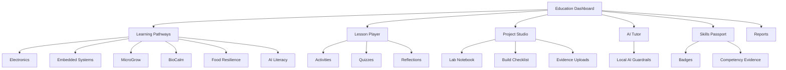

# Module Map

```mermaid
graph TD
A[Education Dashboard] --> B[Learning Pathways]
A --> C[Lesson Player]
A --> D[Project Studio]
A --> E[AI Tutor]
A --> F[Skills Passport]
A --> G[Reports]
B --> H[Electronics]
B --> I[Embedded Systems]
B --> J[MicroGrow]
B --> K[BioCalm]
B --> L[Food Resilience]
B --> M[AI Literacy]
C --> N[Activities]
C --> O[Quizzes]
C --> P[Reflections]
D --> Q[Lab Notebook]
D --> R[Build Checklist]
D --> S[Evidence Uploads]
E --> T[Local AI Guardrails]
F --> U[Badges]
F --> V[Competency Evidence]
```
